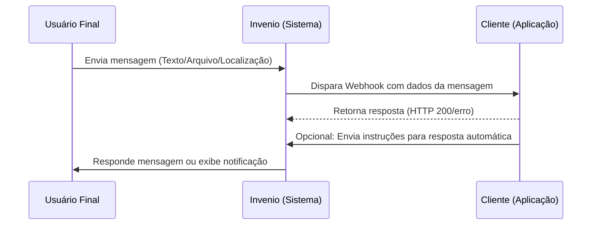

### Como funciona um Webhook?

Um Webhook é um mecanismo de integração que permite que sistemas diferentes se comuniquem em tempo real, utilizando chamadas HTTP para notificar eventos específicos. Ao contrário das APIs tradicionais, que funcionam de maneira mais reativa, onde o cliente precisa fazer requisições para obter informações, os Webhooks adotam uma abordagem proativa. Eles "empurram" dados diretamente para um endpoint configurado no sistema do cliente assim que um evento ocorre no sistema de origem.

Por exemplo, em um contexto de mensagens, um Webhook pode ser configurado para notificar seu sistema sempre que uma mensagem for enviada ou recebida, fornecendo detalhes em tempo real para que ações automáticas possam ser tomadas imediatamente, como armazenar logs, enviar notificações ou atualizar dashboards.

A principal vantagem dos Webhooks está na sua eficiência: eles eliminam a necessidade de realizar consultas constantes ao servidor, economizando recursos e melhorando a responsividade das integrações. Para que funcionem corretamente, é necessário que o sistema receptor tenha um endpoint preparado para receber e processar as notificações enviadas.

Agora que entendemos o conceito de Webhooks, vamos explorar como o Invenio utiliza esse recurso para facilitar integrações em tempo real.

Imagine o **Webhook do Invenio** como um mensageiro automático que trabalha nos bastidores para avisar o seu sistema sobre o que está acontecendo na plataforma Invenio, em tempo real. Aqui estão exemplos simples de como ele funciona:



1. **Mensagens enviadas:**
Assim que o Invenio envia uma mensagem (por exemplo, um WhatsApp para um cliente), ele avisa seu sistema se a mensagem foi entregue com sucesso ou se houve algum problema.

*Exemplo:*  
`Mensagem para o João entregue às 15h.`

2. **Mensagens recebidas:**
Quando alguém responde ou envia uma mensagem para você, o Invenio imediatamente notifica o seu sistema.

*Exemplo:*  
`Mensagem recebida do João: "Preciso de ajuda com o pedido."`

3. **Eventos de KPI:**
Sempre que um indicador importante é registrado (como número de atendimentos concluídos), seu sistema recebe os dados.

*Exemplo:*  
`5 novos atendimentos registrados hoje.`

4. **Campanhas:**
Se você criou uma campanha de mensagens, o Invenio avisa sobre o andamento, como o número de mensagens enviadas ou se a campanha terminou.

*Exemplo:*  
`Campanha "Promoção de Verão" está 75% concluída.`

5. **Carteiras:**
Quando você atualiza as configurações das carteiras (listas de clientes ou grupos), o Invenio avisa sobre qualquer alteração feita.

*Exemplo:*  
`A carteira "Clientes VIP" foi atualizada com 20 novos contatos.`

6. **Templates HSM:**
Se você utiliza mensagens pré-aprovadas (templates HSM) para enviar comunicações, o Webhook informa mudanças de status, qualidade ou edições.

*Exemplo:*  
`Template "Promoção 10%" aprovado com sucesso.`

7. **Linhas WhatsApp:**
Caso sua linha do WhatsApp mude de status (ativa, inativa ou com problemas), o Webhook te avisa.

*Exemplo:*  
`Linha WhatsApp "Suporte" está ativa e funcionando normalmente.`

8. **Usuários:**
Sempre que um usuário da sua equipe faz alterações no sistema, o Webhook registra e envia essas informações.

*Exemplo:*  
`Usuário "Maria" atualizou o perfil dela.`

9. **Protocolos:**
Se você utiliza protocolos para monitorar atendimentos ou processos, o Webhook envia os dados detalhados.

*Exemplo:*  
`Protocolo #12345 foi finalizado com sucesso.`

**Obs.:**
Os eventos enviados pelo Webhook são estruturados no formato **JSON**, garantindo que seu sistema possa processar as informações de maneira organizada e confiável. Os exemplos apresentados acima são apenas ilustrativos para facilitar o entendimento e não representam o formato real das notificações enviadas.

---

## Mensagem de Saida

```json
[{
	"message": {
		"sentAt": "2020-01-31T02:05:21.2900000",
		"direction": "outgoing",
		"id": 1323232224455555,
		"channel": 3,
		"type": "",
		"text": "Teste envio whats!",
		"campaignId": 1234,
		"source": {
			"countryCode": 55,
			"phoneNumber": 11944497777,
			"sender": ""
		},
		"destination": {
			"countryCode": 55,
			"phoneNumber": 11999999992
		},
		"file": {
			"url": "http://s.robbu.com.br/arquivo?hash=ROBBU",
			"name": "robbu",
			"extension": "pdf"
		},
		"contact": {
			"robbuid": 11111111111,
			"name": "TESTE ROBBU",
			"customCode": "1372511",
			"id": "00000000000",
			"mainWhatsapp": {
				"countryCode": 55,
				"phoneNumber": 11999999992
			},
			"mainSMS": {
				"countryCode": 55,
				"phoneNumber": 11999999992
			},
			"mainEmail": "teste@robbu.global",
			"queue": {
				"waitingSince": "2021-03-08 12:00:00",
				"firstAnswerAt": "2021-03-08 11:30:00"
			}
		}
	}
}]
```

### Estrutura dos Campos

<ResponseField name="message" type="Message Object">
  <Expandable title="properties">
    <ResponseField name="sentAt" type="datetime">
      Data e Hora do envio da mensagem.
    </ResponseField>

    <ResponseField name="direction" type="string">
      Direção da mensagem. Pode ser "outgoing" (saída).
    </ResponseField>

    <ResponseField name="id" type="long">
      ID único da mensagem, calculado como (@IdMensagem * 1024) + (cast(@IdCanal as bigint) * 1000000000000000).
    </ResponseField>

    <ResponseField name="channel" type="int">
      ID do canal utilizado para a mensagem.
    </ResponseField>

    <ResponseField name="channelDescription" type="string">
      Descrição do canal utilizado para a mensagem.
    </ResponseField>

    <ResponseField name="type" type="string">
      Tipo de mensagem (e.g., LONGCODE ou SHORTCODE para SMS). Este campo é específico para o canal 2.
    </ResponseField>

    <ResponseField name="text" type="string">
      Texto da mensagem.
    </ResponseField>

    <ResponseField name="campaignId" type="long">
      ID da campanha associada à mensagem.
    </ResponseField>

    <ResponseField name="digitalPostman" type="bool">
      Indica se o envio foi realizado via Carteiro Digital.
    </ResponseField>

    <ResponseField name="templateName" type="string">
      Nome do template associado à mensagem.
    </ResponseField>

    <ResponseField name="templateId" type="long">
      ID do template associado à mensagem.
    </ResponseField>
  </Expandable>
</ResponseField>

<ResponseField name="message.source" type="Source Object">
  <Expandable title="properties">
    <ResponseField name="countryCode" type="int">
      Código do país do remetente.
    </ResponseField>

    <ResponseField name="phoneNumber" type="string">
      Número de telefone do remetente.
    </ResponseField>

    <ResponseField name="email" type="string">
      Email do remetente.
    </ResponseField>

    <ResponseField name="sender" type="string">
      Nome do remetente.
    </ResponseField>
  </Expandable>
</ResponseField>

<ResponseField name="message.destination" type="Destination Object">
  <Expandable title="properties">
    <ResponseField name="countryCode" type="int">
      Código do país do destinatário.
    </ResponseField>

    <ResponseField name="phoneNumber" type="string">
      Número de telefone do destinatário.
    </ResponseField>

    <ResponseField name="provider" type="string">
      Provedor do destinatário.
    </ResponseField>

    <ResponseField name="email" type="string">
      Email do destinatário.
    </ResponseField>
  </Expandable>
</ResponseField>

<ResponseField name="message.file" type="File Object">
  <Expandable title="properties">
    <ResponseField name="url" type="string">
      URL do arquivo associado à mensagem.
    </ResponseField>

    <ResponseField name="name" type="string">
      Nome do arquivo associado à mensagem.
    </ResponseField>

    <ResponseField name="extension" type="string">
      Extensão do arquivo associado à mensagem.
    </ResponseField>
  </Expandable>
</ResponseField>

<ResponseField name="message.contact" type="Contact Object">
  <Expandable title="properties">
    <ResponseField name="robbuid" type="long">
      ID do contato na Robbu.
    </ResponseField>

    <ResponseField name="name" type="string">
      Nome do contato.
    </ResponseField>

    <ResponseField name="createdAt" type="datetime">
      Data e Hora da criação do contato.
    </ResponseField>

    <ResponseField name="lastAnswerAt" type="datetime">
      Data e Hora da última resposta enviada ao contato.
    </ResponseField>

    <ResponseField name="lastIncomingMessageAt" type="datetime">
      Data e Hora da última mensagem recebida do contato.
    </ResponseField>

    <ResponseField name="lastChannelDescription" type="string">
      Descrição do último canal utilizado pelo contato.
    </ResponseField>

    <ResponseField name="customCode" type="string">
      Código personalizado do contato.
    </ResponseField>

    <ResponseField name="id" type="string">
      Identificador do contato.
    </ResponseField>

    <ResponseField name="lastWalletId" type="long">
      ID da última carteira do contato.
    </ResponseField>

    <ResponseField name="lastWalletCode" type="string">
      Código da última carteira do contato.
    </ResponseField>

    <ResponseField name="lastWalletName" type="string">
      Nome da última carteira do contato.
    </ResponseField>
  </Expandable>
</ResponseField>

<ResponseField name="message.mainWhatsapp" type="Whatsapp Object">
  <Expandable title="properties">
    <ResponseField name="countryCode" type="int">
      Código do país do WhatsApp principal do contato.
    </ResponseField>

    <ResponseField name="phoneNumber" type="string">
      Número de telefone do WhatsApp principal do contato.
    </ResponseField>
  </Expandable>
</ResponseField>

<ResponseField name="message.mainSMS" type="SMS Object">
  <Expandable title="properties">
    <ResponseField name="countryCode" type="int">
      Código do país do SMS principal do contato.
    </ResponseField>

    <ResponseField name="phoneNumber" type="string">
      Número de telefone do SMS principal do contato.
    </ResponseField>
  </Expandable>
</ResponseField>

<ResponseField name="message.queue" type="Queue Object">
  <Expandable title="properties">
    <ResponseField name="waitingSince" type="datetime">
      Data e Hora do início da espera do contato na fila.
    </ResponseField>

    <ResponseField name="firstAnswerAt" type="datetime">
      Data e Hora da primeira resposta ao contato.
    </ResponseField>
  </Expandable>
</ResponseField>

<ResponseField name="message.protocol" type="Protocol Object">
  <Expandable title="properties">
    <ResponseField name="number" type="string">
      Número do protocolo associado à mensagem.
    </ResponseField>
  </Expandable>
</ResponseField>

<ResponseField name="message.buttons" type="Button Object">
  <Expandable title="properties">
    <ResponseField name="additionalData" type="string">
      Dados adicionais relacionados aos botões da mensagem (caso aplicável).
    </ResponseField>
  </Expandable>
</ResponseField>


## Mensagem de Entrada

```json
[{
	"message": {
		"receivedAt": "2020-01-31T02:01:03",
		"direction": "incoming",
		"id": 13232322244444,
		"channel": 3,
		"text": "Olá, teste whats!",
		"source": {
			"countryCode": 55,
			"phoneNumber": 11999999992
		},
		"destination": {
			"countryCode": 55,
			"phoneNumber": 11944497777
		},
		"location": {
			"latitude": -23.5535317,
			"longitude": -46.6631181
		},
		"file": {
			"url": "http://s.robbu.com.br/arquivo?hash=ROBBU",
			"name": "robbu",
			"extension": "pdf"
		},
		"contact": {
			"robbuid": 11111111111,
			"name": "TESTE ROBBU",
			"customCode": "1372511",
			"id": "00000000000",
			"mainWhatsapp": {
				"countryCode": 55,
				"phoneNumber": 11999999992
			},
			"mainSMS": {
				"countryCode": 55,
				"phoneNumber": 11999999992
			},
			"mainEmail": "teste@robbu.global"
		}
	}
}]
```

### Estrutura dos Campos

<ResponseField name="message" type="Message Object">
  <Expandable title="properties">
    <ResponseField name="receivedAt" type="datetime">
      Data e Hora de recebimento da mensagem, convertida para UTC.
    </ResponseField>

    <ResponseField name="direction" type="string">
      Direção da mensagem. Valor fixo: "incoming".
    </ResponseField>

    <ResponseField name="id" type="long">
      ID único da mensagem, calculado como (@IdMensagem * 1024) + (cast(@IdCanal as bigint) * 1000000000000000).
    </ResponseField>

    <ResponseField name="channel" type="int">
      ID do canal utilizado para a mensagem.
    </ResponseField>

    <ResponseField name="channelDescription" type="string">
      Descrição do canal utilizado para a mensagem.
    </ResponseField>

    <ResponseField name="text" type="string">
      Texto da mensagem, com caracteres HTML decodificados.
    </ResponseField>

    <ResponseField name="digitalPostman" type="bool">
      Indica se a mensagem foi recebida via Carteiro Digital.
    </ResponseField>

    <ResponseField name="contextMessageId" type="long">
      ID da mensagem de contexto associada à mensagem.
    </ResponseField>
  </Expandable>
</ResponseField>

<ResponseField name="source" type="Source Object">
  <Expandable title="properties">
    <ResponseField name="countryCode" type="int">
      Código do país de origem do remetente.
    </ResponseField>

    <ResponseField name="phoneNumber" type="string">
      Número de telefone do remetente, formatado com DDD.
    </ResponseField>

    <ResponseField name="email" type="string">
      Endereço de email do remetente.
    </ResponseField>
  </Expandable>
</ResponseField>

<ResponseField name="destination" type="Destination Object">
  <Expandable title="properties">
    <ResponseField name="countryCode" type="int">
      Código do país de destino do destinatário.
    </ResponseField>

    <ResponseField name="phoneNumber" type="string">
      Número de telefone do destinatário, formatado com DDD.
    </ResponseField>

    <ResponseField name="email" type="string">
      Endereço de email do destinatário.
    </ResponseField>
  </Expandable>
</ResponseField>

<ResponseField name="file" type="File Object">
  <Expandable title="properties">
    <ResponseField name="url" type="string">
      URL do arquivo associado à mensagem.
    </ResponseField>

    <ResponseField name="name" type="string">
      Nome do arquivo associado à mensagem.
    </ResponseField>

    <ResponseField name="extension" type="string">
      Extensão do arquivo associado à mensagem.
    </ResponseField>
  </Expandable>
</ResponseField>

<ResponseField name="location" type="Location Object">
  <Expandable title="properties">
    <ResponseField name="latitude" type="float">
      Latitude associada à localização da mensagem.
    </ResponseField>

    <ResponseField name="longitude" type="float">
      Longitude associada à localização da mensagem.
    </ResponseField>
  </Expandable>
</ResponseField>

<ResponseField name="contact" type="Contact Object">
  <Expandable title="properties">
    <ResponseField name="robbuid" type="long">
      ID único do contato na Robbu, calculado como (@IdPessoa * 1024).
    </ResponseField>

    <ResponseField name="createdAt" type="datetime">
      Data e Hora da criação do contato, convertida para UTC.
    </ResponseField>

    <ResponseField name="lastAnswerAt" type="datetime">
      Data e Hora da última resposta enviada ao contato, convertida para UTC.
    </ResponseField>

    <ResponseField name="lastIncomingMessageAt" type="datetime">
      Data e Hora da última mensagem recebida do contato, convertida para UTC.
    </ResponseField>

    <ResponseField name="lastChannelDescription" type="string">
      Descrição do último canal utilizado pelo contato.
    </ResponseField>

    <ResponseField name="name" type="string">
      Nome do contato, com caracteres HTML decodificados.
    </ResponseField>

    <ResponseField name="customCode" type="string">
      Código personalizado do contato.
    </ResponseField>

    <ResponseField name="id" type="string">
      Identificador único do contato (e.g., CPF/CNPJ).
    </ResponseField>

    <ResponseField name="mainWhatsapp" type="Whatsapp Object">
      <Expandable title="properties">
        <ResponseField name="countryCode" type="int">
          Código do país do WhatsApp principal do contato.
        </ResponseField>

        <ResponseField name="phoneNumber" type="string">
          Número de telefone do WhatsApp principal do contato.
        </ResponseField>
      </Expandable>
    </ResponseField>

    <ResponseField name="mainSMS" type="SMS Object">
      <Expandable title="properties">
        <ResponseField name="countryCode" type="int">
          Código do país do SMS principal do contato.
        </ResponseField>

        <ResponseField name="phoneNumber" type="string">
          Número de telefone do SMS principal do contato.
        </ResponseField>
      </Expandable>
    </ResponseField>

    <ResponseField name="mainEmail" type="string">
      Email principal do contato.
    </ResponseField>

    <ResponseField name="lastWalletId" type="long">
      ID da última carteira associada ao contato.
    </ResponseField>

    <ResponseField name="lastWalletCode" type="string">
      Código da última carteira associada ao contato.
    </ResponseField>

    <ResponseField name="lastWalletName" type="string">
      Nome da última carteira associada ao contato.
    </ResponseField>

    <ResponseField name="instagram" type="Instagram Object">
      <Expandable title="properties">
        <ResponseField name="username" type="string">
          Nome de usuário no Instagram do contato.
        </ResponseField>
      </Expandable>
    </ResponseField>
  </Expandable>
</ResponseField>

<ResponseField name="protocol" type="Protocol Object">
  <Expandable title="properties">
    <ResponseField name="number" type="string">
      Número do protocolo associado à mensagem.
    </ResponseField>
  </Expandable>
</ResponseField>

## Status de Mensagens

### Exemplo

```json status.json
[{
	"status": {
		"message": {
			"id": 1323232224455555,
			"source": {
				"sender": "User1"
			},
			"sentToProviderAt": "2020-01-31T15:50:39.9312405",
			"deliveredAt": "2020-01-31T15:51:52.9707831",
			"readAt": "2020-01-31T15:53:14.6399299"
		}
	}
}]
```

### Estrtutura dos Campos

| **Campo**                         | **Descrição**                                                       | **Tipo**        |
|--------------------------------------|------------------------------------------------------------------|-----------------|
| `status.message.id`            | Data e Hora do envio da mensagem ao provedor                     | `Datetime`      |
| `status.message.source.sender`                 | Data e Hora de entrega da mensagem                               | `Datetime`      |
| `status.message.sentToProviderAt`                      | Data e Hora da leitura da mensagem                               | `Datetime`      |
| `status.message.deliveredAt`                     | Data e Hora do envio da mensagem                                 | `Datetime`      |
| `status.message.readAt`                  | Data e Hora do recebimento da mensagem                           | `Datetime`      |