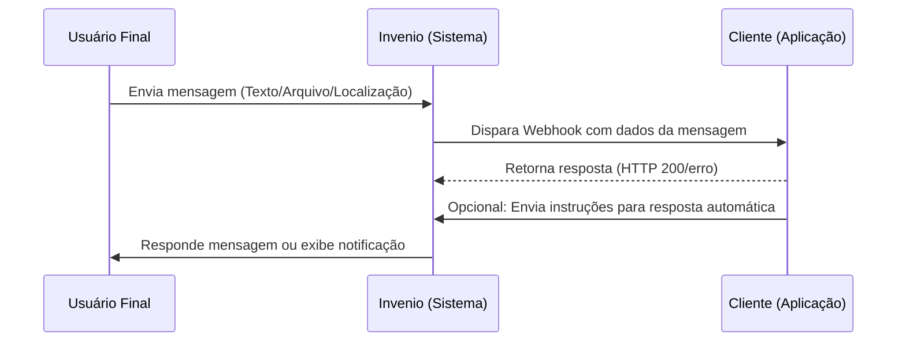

---

## Eventos Disponíveis na Integração
O Webhook pode enviar diferentes tipos de eventos, cobrindo desde mensagens até dados de configuração. Entre os principais, estão:

- **Mensagens enviadas** e atualização de status de entrega;
- **Mensagens recebidas** e atualização de status de recebimento;
-	**KPI Eventos** inseridos no ambiente (manualmente ou pelo sistema);
-	**Campanhas**, incluindo atualizações de status;
-	**Carteiras**, com informações de edição e atualizações de configuração;
-	**Templates HSM**, com status, qualidade e alterações;
- **Linhas WhatsApp**, com status, qualidade e alterações;
- **Relação de usuários**, incluindo logs e mudanças;
- **Protocolos**, com estatísticas e dados associados

---

## Funcionamento da Integração
A comunicação ocorre por meio do envio de blocos JSON para o endpoint configurado. Entre os objetos enviados estão:

`[contact]` · `[event]` · `[messageincoming]` · `[messageoutgoing]` · `[campaign]` · `[template]` · `[protocol]` · `[wallet]` · `[whatsapp numbers]` · `[status]`

> Esses blocos são entregues em lotes de até 30 arquivos JSON, com intervalo médio de 2 segundos, garantindo um fluxo constante de informações.

---

## Requisitos de Infraestrutura

Para ambientes de produção, recomenda-se a seguinte configuração mínima para o servidor endpoint:

- **SSD** de 250 GB  
- **16 GB** de RAM  
- **CPU** com 4 núcleos

> ⚠️ **Importante**  
> O uso de HD não é recomendado, pois pode gerar gargalos devido ao alto volume de mensagens e eventos. A infraestrutura deve ser monitorada continuamente pela área de TI, com possibilidade de escala futura.

---

## Configuração Final no Invenio Center

Após preparar servidor, banco de dados, firewall e publicar o serviço, acesse:

`Invenio Center > Configurações > Webhook > Gerenciar`  
[Acesse a página de configurações](https://inveniocenter.robbu.global/painel/configuracoes)

Adicione a URL final gerada pela IDE ou ambiente de publicação e salve.

> ❗ **Observação**  
> Em até **60 minutos**, as requisições começarão a ser enviadas para o endpoint configurado.

### Fila paralela ⚠️

Por padrão, o Invenio Center disponibiliza dois campos para inclusão de URLs de webhook.  
A **fila paralela** permite adicionar URLs adicionais de webhook, sujeita a custo extra na fatura.

> Para mais informações, entre em contato com o gerente comercial responsável pela sua conta.

---

# Mapeamento de Campos

Além dos exemplos de JSONs retornados pelo Webhook, é fundamental compreender a estrutura de campos utilizada.  
Abaixo, apresentamos a organização desses dados, que servirá de base para a manipulação e integração adequada dentro do ambiente do cliente.

### Message (Mensagem)

| Campo | Descrição | Tipo |
|---|---|---|
| `MessageSentToProviderAt` | Data e hora do envio da mensagem ao provedor | `Datetime` |
| `MessageDeliveredAt` | Data e hora da entrega da mensagem | `Datetime` |
| `MessageReadAt` | Data e hora da leitura da mensagem | `Datetime` |
| `MessageFailedAt` | Data e hora da falha na entrega da mensagem | `Datetime` |
| `MessagemSentAt` | Data e hora do envio da mensagem | `Datetime` |
| `MessageReceivedAt` | Data e hora do recebimento da mensagem | `Datetime` |
| `MessageCampaignid` | ID da campanha | `Int` |
| `MessageType` | Tipo do envio da mensagem | `String` |
| `MessageDirection` | Direção da mensagem: Outcoming (saída) ou Incoming (entrada) | `String` |
| `MessageId` | ID da mensagem | `Long` |
| `MessageChannel` | Canal da mensagem (ver enumeração abaixo) | `Int` |
| `MessageText` | Texto da mensagem | `String` |
| `MessageSourceCountryCode` | Código do país do remetente | `Int` |
| `MessageSourcePhoneNumber` | Número de telefone do remetente | `Long` |
| `MessageSourceEmail` | E-mail do remetente | `String` |
| `MessageDestinationCountryCode` | Código do país do destinatário | `Int` |
| `MessageDestinationPhoneNumber` | Número de telefone do destinatário | `Long` |
| `MessageDestinationEmail` | E-mail do destinatário | `String` |
| `ContactRobbuId` | ID do contato na Robbu | `Long` |
| `ContactName` | Nome do contato | `String` |
| `ContactID` | ID do contato | `String` |
| `ContactCustomCode` | Código do cliente do contato | `String` |
| `ContactMainEmail` | E-mail principal do contato | `String` |
| `ContactMainWhatsAppCountryCode` | Código do país da linha principal de WhatsApp | `Int` |
| `ContactMainWhatsAppPhoneNumber` | Número de WhatsApp principal do contato | `Long` |
| `ContactMainSmsCountryCode` | Código do país da linha principal de SMS | `Int` |
| `ContactMainSmsPhoneNumber` | Número de SMS principal do contato | `Long` |
| `QueueWaitingSince` | Início da espera do contato na fila da operação | `Datetime` |
| `QueueFirstAnswerAt` | Primeira resposta ao contato | `Datetime` |
| `ContactLastWalletCode` | Código do último segmento do contato | `String` |
| `ContactLastWalletName` | Nome do último segmento do contato | `String` |
| `ContactLastChannelDescripton` | Descrição do último canal do contato | `String` |
| `ContactCreatedAt` | Data e hora de inclusão do contato | `Datetime` |
| `ContactLastAnswearAt` | Data e hora da última mensagem enviada ao contato pela operação | `Datetime` |
| `ContactLastIncomingMessageAt` | Data e hora da última mensagem recebida do contato | `Datetime` |
| `DigitalPostman` | Indica se o envio é via Carteiro Digital | `Bool` |
| `LocationLatitude` | Latitude de localização | `Double` |
| `LocationLongitude` | Longitude de localização | `Double` |
| `FileUrl` | URL do arquivo | `String` |
| `FileName` | Nome do arquivo | `String` |
| `FileExtension` | Extensão do arquivo | `String` |
| `ProtocolMessageId` | ID do protocolo | `Long` |
| `ProtocolMessageNumber` | Número do protocolo | `String` |
| `MessageErrorCode` | Código da falha na entrega da mensagem | `String` |
| `ErrorMessage` | Descrição do erro de entrega | `String` |
| `MessageChannelDescription` | Descrição do canal | `String` |
| `MessageTemplateName` | Nome do template | `String` |
| `MessageTemplateId` | ID do template | `Long` |

**Enumeração – MessageChannel**  
`1` E-mail · `2` SMS · `3` WhatsApp · `4` Chat · `5` Facebook · `6` Telegram · `7` Voz · `8` Instagram · `9` Viber

---

### Status

| Campo | Descrição | Tipo |
|---|---|---|
| `MessageStatusId` | ID do status da mensagem | `Long` |
| `SourceStatusSender` | Remetente do status de origem | `String` |
| `MessageStatusSentToProviderAt` | Envio do status ao provedor | `Datetime` |
| `MessageStatusDeliveredAt` | Entrega do status | `Datetime` |
| `MessageStatusReadAt` | Leitura do status | `Datetime` |
| `MessageStatusSentAt` | Envio da mensagem | `Datetime` |
| `MessageStatusFailedAt` | Falha no envio da mensagem | `Datetime` |
| `MessageStatusDigitalPostman` | Indica envio via Carteiro Digital | `Bool` |
| `MessageStatusErrorCode` | Código de erro da mensagem | `String` |
| `MessageStatusErrorMessage` | Descrição do erro da mensagem | `String` |
| `ContactStatusRobbuId` | ID do status do contato na Robbu | `Long` |

---

### Event (KPI Evento)

| Campo | Descrição | Tipo |
|---|---|---|
| `ID` | ID do evento | `Long` |
| `Description` | Descrição do evento | `String` |
| `Note` | Observação do evento | `String` |
| `CustomCode` | Código customizado do evento | `String` |
| `Sender` | Usuário responsável pelo evento | `String` |
| `Finalized` | Indica se é um evento finalizador | `Bool` |
| `Type` | Tipo do evento: negativo, neutro ou positivo | `String` |
| `ProtocolNumber` | Número do protocolo | `String` |
| `ProtocolID` | ID do protocolo | `Long` |
| `ContactRobbuId` | ID único do contato na Robbu | `Long` |
| `ContactName` | Nome do contato | `String` |
| `ContactID` | ID do contato | `String` |
| `ContactCustomCode` | Código do cliente do contato | `String` |
| `ContactMainEmail` | E-mail principal do contato | `String` |
| `ContactMainWhatsAppCountryCode` | Código do país da linha principal de WhatsApp | `Int` |
| `ContactMainWhatsAppPhoneNumber` | Número de WhatsApp principal do contato | `Long` |
| `ContactMainSmsCountryCode` | Código do país da linha principal de SMS | `Int` |
| `ContactMainSmsPhoneNumber` | Número de SMS principal do contato | `Long` |
| `QueueWaitingSince` | Início da espera na fila da operação | `Datetime` |
| `QueueFirstAnswerAt` | Primeira resposta ao contato | `Datetime` |
| `ContactLastWalletCode` | Código do último segmento do contato | `String` |
| `ContactLastWalletName` | Nome do último segmento do contato | `String` |
| `ContactLastChannelDescripton` | Descrição do último canal do contato | `String` |
| `ContactCreatedAt` | Data e hora de inclusão do contato | `Datetime` |
| `ContactLastAnswearAt` | Última mensagem enviada ao contato pela operação | `Datetime` |
| `ContactLastIncomingMessageAt` | Última mensagem recebida do contato | `Datetime` |

---

### Campaign (Campanha)

| Campo | Descrição | Tipo |
|---|---|---|
| `CreatedAt` | Data e hora de criação da campanha | `Datetime` |
| `CreatedBy` | Usuário responsável pela campanha | `String` |
| `Id` | ID da campanha | `Int` |
| `Channel` | Canal da campanha (ver enumeração abaixo) | `Int` |
| `ChannelDescription` | Descrição do canal | `String` |
| `StartAt` | Início da campanha | `Datetime` |
| `Size` | Quantidade de mensagens a enviar | `Int` |
| `Message` | Template enviado na campanha | `String` |
| `HoursToDiscard` | Horas para descartar quando o contato já está em atendimento por outro canal | `Int` |
| `TypeCampaignCode` | Código interno do tipo de campanha | `String` |
| `TypeCampaignDescription` | Descrição do tipo de campanha [1-SMS; 2-WhatsApp; 3-E-mail; 4-Voz] | `String` |
| `SplitSendPercentage` | Percentual para fracionar o envio | `Double` |
| `SplitSendMinutes` | Intervalo (min) entre envios | `Int` |
| `MailingDescription` | Descrição do mailing | `String` |
| `MailingImportedAt` | Importação do mailing (data/hora) | `Datetime` |
| `MailingImportedBy` | Usuário que importou o mailing | `String` |
| `MailingSize` | Quantidade de registros no mailing | `Int` |
| `MailingWalletClientCode` | Código da carteira do mailing | `String` |
| `TotalSent` | Total de mensagens enviadas | `Int` |
| `CampaignLastSentAt` | Data e hora da última mensagem enviada | `Datetime` |
| `CampaignStatusCode` | Código de status da campanha | `String` |
| `CampaignDescription` | Descrição do tipo de campanha | `String` |

**Enumeração – Channel**  
`1` E-mail · `2` SMS · `3` WhatsApp · `4` Chat · `5` Facebook · `6` Telegram · `7` Voz · `8` Instagram · `9` Viber

**TypeCampaignCode**  
`EM` E-mail · `SL` SMS Long · `SS` SMS Short · `VW` Voz Way · `WB` WhatsApp Broadcast · `WE` WhatsApp Oficial Exclusivo · `WP` WhatsApp Prospect Convencional · `WO/WC` WhatsApp Oficial Compartilhado

**CampaignStatusCode**  
`C` Cancelada · `E` Não enviada · `F` Finalizada · `I` Iniciada · `P` Aguardando processamento

---

### Template

| Campo | Descrição | Tipo |
|---|---|---|
| `Id` | ID do template | `Long` |
| `Name` | Nome do template | `String` |
| `Event` | Status da ação (Updated, Created) | `String` |
| `EventAt` | Data e hora de inclusão/alteração | `Datetime` |
| `Status` | Status na Meta [Approved; Reject; Deleted; Disabled] | `String` |
| `Quality` | Qualidade na Meta [Green; Yellow; Red; Deleted; Disabled] | `String` |
| `Category` | Categoria na Meta [Utility; Marketing; Service; Authentication] | `String` |
| `Language` | Idioma do template | `String` |

---

### Protocol (Protocolo)

| Campo | Descrição | Tipo |
|---|---|---|
| `Event` | Status da ação realizada ao protocolo [Updated; Created] | `String` |
| `EventAt` | Data e hora de inclusão do protocolo | `Datetime` |
| `Id` | ID do protocolo | `Long` |
| `Number` | Número do protocolo | `String` |
| `GeneratedAt` | Data e hora de geração do protocolo | `Datetime` |
| `GenerationChannelDescription` | Descrição do canal do protocolo gerado | `String` |
| `GenerationWalletName` | Nome do segmento onde o protocolo foi gerado | `String` |
| `GenerationWalletCode` | Código do segmento onde o protocolo foi gerado | `String` |
| `GenerationWalletId` | ID do segmento gerado | `Long` |
| `SegmentId` | ID do segmento | `Long` |
| `SegmentName` | Nome do segmento | `String` |
| `ContactProtocolId` | ID do protocolo do contato | `String` |
| `ContactProtocolRobbuId` | ID do protocolo na Robbu | `Long` |
| `FirstMessageIdrAt` | Primeira mensagem na IDR | `Datetime` |
| `LastMessageIdrAt` | Última mensagem na IDR | `Datetime` |
| `IdrClosedAt` | Encerramento do atendimento na IDR | `Datetime` |
| `LastMessageContactIdrAt` | Última mensagem do contato para a IDR | `Datetime` |
| `FirstMessageFromHumanAttendanceAt` | Primeira mensagem da operação | `Datetime` |
| `IdrMessagesCount` | Total de mensagens da IDR | `Long` |
| `HumanAttendanceMessagesCount` | Total de mensagens de atendentes | `Long` |
| `IncomingMessagesCount` | Total de mensagens recebidas | `Long` |
| `HumanAttendanceAnswersCount` | Total de respostas de atendentes | `Long` |
| `ContactAnswersCount` | Total de respostas do contato | `Long` |
| `HumanAttendanceAnswersTotalTimeInSeconds` | Soma total (seg) das respostas da operação | `Long` |
| `ContactAnswersTotalTimeInSeconds` | Soma total (seg) das respostas do contato | `Long` |
| `IdrAnswersTotalTimeInSeconds` | Soma total (seg) das respostas da IDR | `Long` |
| `IdrAnswersCount` | Total de respostas da IDR | `Long` |
| `ClosedAt` | Encerramento do protocolo | `Datetime` |
| `ClosingUserInfo` | Nome do usuário que encerrou | `String` |
| `ClosingEventId` | ID do evento de encerramento | `Long` |
| `ClosingEventName` | Nome do evento de encerramento | `String` |
| `ClosingEventCode` | Código do evento de encerramento | `String` |
| `AbandonedAt` | Abandono do protocolo | `Datetime` |

---

### User (Usuário)

| Campo | Descrição | Tipo |
|---|---|---|
| `Id` | ID do usuário | `Long` |
| `Name` | Nome do usuário | `String` |
| `Event` | Status da ação [Updated; Created] | `String` |
| `EventAt` | Data e hora de criação/edição | `Datetime` |
| `Completename` | Nome completo do usuário | `String` |
| `AcessGroup` | Grupo de acesso | `String` |
| `AcessGroupDescription` | Descrição do grupo de acesso | `String` |
| `EmailAddress` | Endereço de e-mail do usuário | `String` |
| `LastLoginAt` | Último login | `Datetime` |
| `IsActive` | Usuário ativo/inativo | `Bool` |
| `LastQueueUpdateAt` | Última atualização da fila de atendimento | `Datetime` |
| `LastPasswordChangeAT` | Última troca de senha | `Datetime` |
| `IsLogged` | Indica se está logado | `Bool` |

---

### Wallet (Carteira)

| Campo | Descrição | Tipo |
|---|---|---|
| `Id` | ID do segmento | `Long` |
| `Name` | Nome do segmento | `String` |
| `Code` | Código do segmento | `String` |
| `Event` | Status da ação [Updated; Created; Deleted] | `String` |
| `EventAt` | Data e hora da criação/edição | `Datetime` |
| `DistributionMethod` | Método de distribuição de contatos | `String` |
| `DistributionMethodDescription` | Descrição do método de distribuição | `String` |

---

### WhatsApp Numbers (Números WhatsApp)

| Campo | Descrição | Tipo |
|---|---|---|
| `Event` | Status da ação na linha WhatsApp [Created; Updated] | `String` |
| `EventAt` | Data e hora de inclusão/alteração | `Datetime` |
| `Id` | ID da linha WhatsApp | `Long` |
| `WalletId` | ID do segmento | `Long` |
| `Status` | Qualidade da linha na Meta [Green; Yellow; Red; Unknown] | `String` |
| `CountryCode` | Código do país | `String` |
| `AreaCode` | Código de área | `String` |
| `PhoneNumber` | Número de telefone da linha WhatsApp | `String` |
| `IsActive` | Linha ativa | `Bool` |
| `BroadCastLimitPerDay` | Limite diário de envios (Meta) | `Int` |
| `CanSendHsm` | Linha habilitada para envio de HSM | `Bool` |

---

## Exemplo Prático de Funcionamento da Integração com Webhook

1. **Mensagens enviadas:**
Assim que o Invenio envia uma mensagem (por exemplo, um WhatsApp para um cliente), ele avisa seu sistema se a mensagem foi entregue com sucesso ou se houve algum problema.

*Exemplo:*  
`Mensagem para o João entregue às 15h.`

2. **Mensagens recebidas:**
Quando alguém responde ou envia uma mensagem para você, o Invenio imediatamente notifica o seu sistema.

*Exemplo:*  
`Mensagem recebida do João: "Preciso de ajuda com o pedido."`

3. **Eventos de KPI:**
Sempre que um indicador importante é registrado (como número de atendimentos concluídos), seu sistema recebe os dados.

*Exemplo:*  
`5 novos atendimentos registrados hoje.`

4. **Campanhas:**
Se você criou uma campanha de mensagens, o Invenio avisa sobre o andamento, como o número de mensagens enviadas ou se a campanha terminou.

*Exemplo:*  
`Campanha "Promoção de Verão" está 75% concluída.`

5. **Carteiras:**
Quando você atualiza as configurações das carteiras (listas de clientes ou grupos), o Invenio avisa sobre qualquer alteração feita.

*Exemplo:*  
`A carteira "Clientes VIP" foi atualizada com 20 novos contatos.`

6. **Templates HSM:**
Se você utiliza mensagens pré-aprovadas (templates HSM) para enviar comunicações, o Webhook informa mudanças de status, qualidade ou edições.

*Exemplo:*  
`Template "Promoção 10%" aprovado com sucesso.`

7. **Linhas WhatsApp:**
Caso sua linha do WhatsApp mude de status (ativa, inativa ou com problemas), o Webhook te avisa.

*Exemplo:*  
`Linha WhatsApp "Suporte" está ativa e funcionando normalmente.`

8. **Usuários:**
Sempre que um usuário da sua equipe faz alterações no sistema, o Webhook registra e envia essas informações.

*Exemplo:*  
`Usuário "Maria" atualizou o perfil dela.`

9. **Protocolos:**
Se você utiliza protocolos para monitorar atendimentos ou processos, o Webhook envia os dados detalhados.

*Exemplo:*  
`Protocolo #12345 foi finalizado com sucesso.`

**Obs.:**
Os eventos enviados pelo Webhook são estruturados no formato **JSON**, garantindo que seu sistema possa processar as informações de maneira organizada e confiável. Os exemplos apresentados acima são apenas ilustrativos para facilitar o entendimento e não representam o formato real das notificações enviadas.

---

## 🔗 Links e assuntos relacionados

- [Configurações gerais da conta (Invenio Center)](https://docs.robbu.global/docs/center/configuracoes-gerais-da%20conta)
- [Lista de IPs para liberação de firewall](https://docs.robbu.global/docs/configuracoes-gerais/lista-ips)

---

## ⁉️ Perguntas Frequentes (FAQ)

<AccordionGroup>
  <Accordion title="Quais objetos o Webhook do Invenio envia para meu endpoint?">
    São enviados blocos JSON dos seguintes objetos: <b>contact</b>, <b>event</b>, <b>messageincoming</b>, <b>messageoutgoing</b>, <b>campaign</b>, <b>template</b>, <b>protocol</b>, <b>wallet</b>, <b>whatsapp numbers</b> e <b>status</b>.
  </Accordion>

  <Accordion title="Com que frequência os lotes são entregues? Existe limite por lote?">
    Sim. As entregas ocorrem em <b>lotes de até 30 arquivos JSON</b> com <b>intervalo médio de 2 segundos</b> entre os lotes, garantindo fluxo constante e organizado.
  </Accordion>

  <Accordion title="Após configurar o endpoint, quando começam a chegar os dados?">
    As requisições passam a ser disparadas em até <b>60 minutos</b> após o salvamento da URL do endpoint no Invenio Center.
  </Accordion>

  <Accordion title="É obrigatório usar HTTPS no endpoint?">
    É <b>altamente recomendado</b> utilizar HTTPS para garantir segurança no transporte dos dados. Além disso, é necessário liberar os <b>IPs oficiais</b> no firewall para assegurar a conectividade.
  </Accordion>

  <Accordion title="Quais são os requisitos mínimos de infraestrutura para produção?">
    Recomendamos <b>SSD de 250 GB</b>, <b>16 GB de RAM</b> e <b>CPU com 4 núcleos</b>. O uso de HD não é indicado devido ao volume de mensagens e eventos.
  </Accordion>

  <Accordion title="Posso utilizar meu banco de dados e minha infraestrutura atuais?">
    Sim. A solução é compatível com infraestrutura <b>cloud</b> ou <b>on-premises</b>, mas a tecnologia do banco fica a critério do cliente, desde que a TI garanta operação e manutenção.
  </Accordion>

  <Accordion title="Para que serve a 'fila paralela' de Webhook? Há custo adicional?">
    A <b>fila paralela</b> permite configurar URLs adicionais para recebimento dos JSONs. Essa configuração pode <b>gerar cobrança adicional</b>; consulte o gerente comercial da sua conta para mais detalhes.
  </Accordion>

  <Accordion title="Onde faço a configuração final do Webhook no Invenio?">
    Em <b>Invenio Center &gt; Configurações &gt; Webhook &gt; Gerenciar</b>. Após publicar seu serviço e liberar o firewall, informe a URL e salve.
  </Accordion>

  <Accordion title="Como validar se estou recebendo mensagens e eventos corretamente?">
    Monitore seu endpoint e banco externo, verificando a criação/atualização das tabelas do <b>Script_Tabelas_Robbu.sql</b>. Utilize também os recursos de <b>filtros e busca</b> e a documentação de <b>envio de mensagens</b> para cruzar informações durante os testes.
  </Accordion>
</AccordionGroup>
