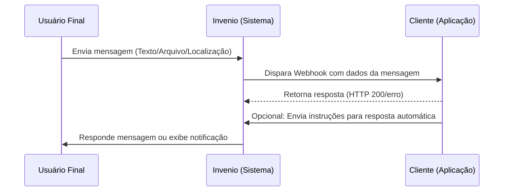

A integração via **Webhook** permite comunicação em tempo quase real entre o Invenio Center, o Invenio Live e sistemas externos. Eventos importantes são enviados automaticamente para o endpoint configurado, permitindo que sua operação registre, trate e analise dados de forma ágil e integrada.

<Note>
Os dados são enviados em **lotes de até 30 arquivos JSON**, com intervalo médio de **2 segundos** entre os lotes.
</Note>

---

## Eventos Disponíveis

| Evento | Descrição |
|--------|-----------|
| **Mensagens enviadas** | Status de entrega das mensagens saintes |
| **Mensagens recebidas** | Notificação de mensagens entrantes |
| **KPI Eventos** | Indicadores inseridos no ambiente (manual ou sistema) |
| **Campanhas** | Criação e atualização de status de campanhas |
| **Carteiras** | Edições e atualizações de configuração de segmentos |
| **Templates HSM** | Status, qualidade e alterações de templates |
| **Linhas WhatsApp** | Status, qualidade e alterações das linhas |
| **Usuários** | Logs e mudanças de usuários |
| **Protocolos** | Estatísticas e dados de protocolos de atendimento |

**Objetos JSON enviados:**
`contact` · `event` · `messageincoming` · `messageoutgoing` · `campaign` · `template` · `protocol` · `wallet` · `whatsappnumbers` · `status`

---

## Linguagens Suportadas

Os webhooks do Invenio são baseados em **HTTP** — qualquer linguagem que suporte servidor web pode ser utilizada.

| Linguagem | Framework sugerido |
|-----------|--------------------|
| JavaScript / Node.js | Express |
| Python | Flask, Django ou FastAPI |
| C# (.NET) | ASP.NET Core |
| Java | Spring Boot |
| PHP | Laravel, Symfony ou nativo `$_POST` |
| Go, Ruby, Rust, Elixir | Qualquer lib HTTP nativa |

---

## Requisitos de Infraestrutura (Produção)

<Warning>
**Configuração mínima recomendada para o servidor endpoint:**

| Componente | Requisito mínimo |
|------------|-----------------|
| **Armazenamento** | SSD de 250 GB |
| **Memória RAM** | 16 GB |
| **CPU** | 4 núcleos |

⚠️ O uso de **HD** não é recomendado — pode gerar gargalos pelo alto volume de mensagens e eventos. Monitore a infraestrutura continuamente com possibilidade de escala futura.
</Warning>

---

## Configurar o Webhook no Invenio Center

**Caminho:** Invenio Center > Configurações > **Webhook > Gerenciar**

<Tip>
**Acesso direto:** [Configurações](https://inveniocenter.robbu.global/painel/configuracoes)
</Tip>

<Steps>
  <Step title="Preparar o servidor endpoint">
    Configure e publique o endpoint na sua infraestrutura (servidor, banco de dados, firewall).

    Certifique-se de que os **IPs do Invenio** estão liberados no firewall.

    Consulte: [Lista de IPs para liberação](https://docs.robbu.global/docs/configuracoes-gerais/lista-ips)
  </Step>

  <Step title="Acessar configurações do Webhook">
    Acesse: **Invenio Center > Configurações > Webhook > Gerenciar**

    <Frame caption="Tela de gerenciamento do Webhook">
      
    </Frame>

    <Frame caption="Configuração da URL do endpoint">
      
    </Frame>

    <Frame caption="Confirmação de configuração salva">
      
    </Frame>
  </Step>

  <Step title="Adicionar a URL do endpoint">
    Cole a URL gerada pelo seu servidor/ambiente de publicação no campo disponível e clique em **Salvar**.

    <Check>
    Em até **60 minutos**, as requisições começarão a ser disparadas para o endpoint configurado.
    </Check>
  </Step>
</Steps>

<Note>
**Fila paralela:** O Invenio disponibiliza dois campos para URLs de Webhook por padrão. A inclusão de URLs adicionais (fila paralela) está sujeita a **custo extra** — consulte o gerente comercial responsável pela sua conta.
</Note>

---

## Diagrama de Funcionamento



---

## Mapeamento de Campos

### Message (Mensagem)

| Campo | Descrição | Tipo |
|-------|-----------|------|
| `MessageSentToProviderAt` | Data/hora do envio ao provedor | `Datetime` |
| `MessageDeliveredAt` | Data/hora da entrega | `Datetime` |
| `MessageReadAt` | Data/hora da leitura | `Datetime` |
| `MessageFailedAt` | Data/hora da falha na entrega | `Datetime` |
| `MessagemSentAt` | Data/hora do envio | `Datetime` |
| `MessageReceivedAt` | Data/hora do recebimento | `Datetime` |
| `MessageCampaignid` | ID da campanha | `Int` |
| `MessageType` | Tipo de envio | `String` |
| `MessageDirection` | `incoming` (entrada) ou `outgoing` (saída) | `String` |
| `MessageId` | ID da mensagem | `Long` |
| `MessageChannel` | Canal (ver enumeração) | `Int` |
| `MessageText` | Texto da mensagem | `String` |
| `MessageSourceCountryCode` | Código do país do remetente | `Int` |
| `MessageSourcePhoneNumber` | Telefone do remetente | `Long` |
| `MessageSourceEmail` | E-mail do remetente | `String` |
| `MessageDestinationCountryCode` | Código do país do destinatário | `Int` |
| `MessageDestinationPhoneNumber` | Telefone do destinatário | `Long` |
| `MessageDestinationEmail` | E-mail do destinatário | `String` |
| `ContactRobbuId` | ID do contato na Robbu | `Long` |
| `ContactName` | Nome do contato | `String` |
| `ContactID` | ID do contato | `String` |
| `ContactCustomCode` | Código do cliente | `String` |
| `ContactMainEmail` | E-mail principal | `String` |
| `ContactMainWhatsAppCountryCode` | Código do país (WhatsApp) | `Int` |
| `ContactMainWhatsAppPhoneNumber` | Número WhatsApp principal | `Long` |
| `ContactMainSmsCountryCode` | Código do país (SMS) | `Int` |
| `ContactMainSmsPhoneNumber` | Número SMS principal | `Long` |
| `QueueWaitingSince` | Início da espera na fila | `Datetime` |
| `QueueFirstAnswerAt` | Primeira resposta ao contato | `Datetime` |
| `ContactLastWalletCode` | Código do último segmento | `String` |
| `ContactLastWalletName` | Nome do último segmento | `String` |
| `ContactLastChannelDescripton` | Último canal do contato | `String` |
| `ContactCreatedAt` | Data/hora de inclusão do contato | `Datetime` |
| `ContactLastAnswearAt` | Última mensagem enviada ao contato | `Datetime` |
| `ContactLastIncomingMessageAt` | Última mensagem recebida do contato | `Datetime` |
| `DigitalPostman` | Envio via Carteiro Digital | `Bool` |
| `LocationLatitude` | Latitude de localização | `Double` |
| `LocationLongitude` | Longitude de localização | `Double` |
| `FileUrl` | URL do arquivo | `String` |
| `FileName` | Nome do arquivo | `String` |
| `FileExtension` | Extensão do arquivo | `String` |
| `ProtocolMessageId` | ID do protocolo | `Long` |
| `ProtocolMessageNumber` | Número do protocolo | `String` |
| `MessageErrorCode` | Código de falha na entrega | `String` |
| `ErrorMessage` | Descrição do erro | `String` |
| `MessageChannelDescription` | Descrição do canal | `String` |
| `MessageTemplateName` | Nome do template | `String` |
| `MessageTemplateId` | ID do template | `Long` |

**Enumeração – MessageChannel:**
`1` E-mail · `2` SMS · `3` WhatsApp · `4` Chat · `5` Facebook · `6` Telegram · `7` Voz · `8` Instagram · `9` Viber

<AccordionGroup>
  <Accordion title="Modelo JSON — Mensagem de Entrada (Incoming)">
    ```json
    "message": {
      "receivedAt": "2020-01-31T02:01:03",
      "direction": "incoming",
      "id": 13232322244444,
      "channel": 3,
      "text": "Olá, teste whats!",
      "source": {
        "countryCode": 55,
        "phoneNumber": 11999999992
      },
      "destination": {
        "countryCode": 55,
        "phoneNumber": 11944497777
      },
      "location": {
        "latitude": -23.5535317,
        "longitude": -46.6631181
      },
      "file": {
        "url": "http://s.robbu.com.br/arquivo?hash=ROBBU",
        "name": "robbu",
        "extension": "pdf"
      },
      "contact": {
        "robbuid": 11111111111,
        "name": "TESTE ROBBU",
        "customCode": "1372511",
        "id": "00000000000",
        "mainWhatsapp": { "countryCode": 55, "phoneNumber": 11999999992 },
        "mainSMS": { "countryCode": 55, "phoneNumber": 11999999992 },
        "mainEmail": "teste@robbu.global"
      }
    }
    ```
  </Accordion>

  <Accordion title="Modelo JSON — Mensagem de Saída (Outgoing)">
    ```json
    "message": {
      "sentAt": "2020-01-31T02:05:21.2900000",
      "direction": "outgoing",
      "id": 1323232224455555,
      "channel": 3,
      "type": "",
      "text": "Teste envio whats!",
      "campaignId": 1234,
      "source": {
        "countryCode": 55,
        "phoneNumber": 11944497777,
        "sender": ""
      },
      "destination": {
        "countryCode": 55,
        "phoneNumber": 11999999992
      },
      "file": {
        "url": "http://s.robbu.com.br/arquivo?hash=ROBBU",
        "name": "robbu",
        "extension": "pdf"
      },
      "contact": {
        "robbuid": 11111111111,
        "name": "TESTE ROBBU",
        "customCode": "1372511",
        "id": "00000000000",
        "mainWhatsapp": { "countryCode": 55, "phoneNumber": 11999999992 },
        "mainSMS": { "countryCode": 55, "phoneNumber": 11999999992 },
        "mainEmail": "teste@robbu.global",
        "queue": {
          "waitingSince": "2021-03-08 12:00:00",
          "firstAnswerAt": "2021-03-08 11:30:00"
        }
      }
    }
    ```
  </Accordion>
</AccordionGroup>

---

### Status

| Campo | Descrição | Tipo |
|-------|-----------|------|
| `MessageStatusId` | ID do status | `Long` |
| `SourceStatusSender` | Remetente do status | `String` |
| `MessageStatusSentToProviderAt` | Envio ao provedor | `Datetime` |
| `MessageStatusDeliveredAt` | Entrega | `Datetime` |
| `MessageStatusReadAt` | Leitura | `Datetime` |
| `MessageStatusSentAt` | Envio da mensagem | `Datetime` |
| `MessageStatusFailedAt` | Falha no envio | `Datetime` |
| `MessageStatusDigitalPostman` | Envio via Carteiro Digital | `Bool` |
| `MessageStatusErrorCode` | Código de erro | `String` |
| `MessageStatusErrorMessage` | Descrição do erro | `String` |
| `ContactStatusRobbuId` | ID do contato na Robbu | `Long` |

<Accordion title="Modelo JSON — Status">
  ```json
  "status": {
    "message": {
      "id": 1323232224455555,
      "source": { "sender": "User1" },
      "sentToProviderAt": "2020-01-31T15:50:39.9312405",
      "deliveredAt": "2020-01-31T15:51:52.9707831",
      "readAt": "2020-01-31T15:53:14.6399299"
    }
  }
  ```
</Accordion>

---

### Event (KPI Evento)

| Campo | Descrição | Tipo |
|-------|-----------|------|
| `ID` | ID do evento | `Long` |
| `Description` | Descrição do evento | `String` |
| `Note` | Observação | `String` |
| `CustomCode` | Código customizado | `String` |
| `Sender` | Usuário responsável | `String` |
| `Finalized` | Evento finalizador | `Bool` |
| `Type` | Tipo: negativo, neutro ou positivo | `String` |
| `ProtocolNumber` | Número do protocolo | `String` |
| `ProtocolID` | ID do protocolo | `Long` |
| `ContactRobbuId` | ID único do contato | `Long` |
| `ContactName` | Nome do contato | `String` |
| `ContactID` | ID do contato | `String` |
| `ContactCustomCode` | Código do cliente | `String` |
| `ContactMainEmail` | E-mail principal | `String` |
| `ContactMainWhatsAppCountryCode` | Código do país (WhatsApp) | `Int` |
| `ContactMainWhatsAppPhoneNumber` | Número WhatsApp principal | `Long` |
| `ContactMainSmsCountryCode` | Código do país (SMS) | `Int` |
| `ContactMainSmsPhoneNumber` | Número SMS principal | `Long` |
| `QueueWaitingSince` | Início da espera na fila | `Datetime` |
| `QueueFirstAnswerAt` | Primeira resposta | `Datetime` |
| `ContactLastWalletCode` | Código do último segmento | `String` |
| `ContactLastWalletName` | Nome do último segmento | `String` |
| `ContactLastChannelDescripton` | Último canal | `String` |
| `ContactCreatedAt` | Inclusão do contato | `Datetime` |
| `ContactLastAnswearAt` | Última mensagem enviada | `Datetime` |
| `ContactLastIncomingMessageAt` | Última mensagem recebida | `Datetime` |

<Accordion title="Modelo JSON — KPI Evento">
  ```json
  "event": {
    "createdAt": "2020-01-31T02:05:21.0566667",
    "id": 13232322244599998,
    "description": "[CR] Saudacao Final",
    "note": "Saudacao Final",
    "customCode": "298",
    "finalized": false,
    "sender": "",
    "type": "Neutro",
    "contact": {
      "robbuid": 11111111111,
      "name": "TESTE ROBBU",
      "customCode": "1372511",
      "id": "00000000000",
      "mainWhatsapp": { "countryCode": 55, "phoneNumber": 11999999992 },
      "mainSMS": { "countryCode": 55, "phoneNumber": 11999999992 },
      "mainEmail": "teste@robbu.global"
    }
  }
  ```
</Accordion>

---

### Campaign (Campanha)

| Campo | Descrição | Tipo |
|-------|-----------|------|
| `CreatedAt` | Data/hora de criação | `Datetime` |
| `CreatedBy` | Usuário responsável | `String` |
| `Id` | ID da campanha | `Int` |
| `Channel` | Canal (ver enumeração) | `Int` |
| `ChannelDescription` | Descrição do canal | `String` |
| `StartAt` | Início da campanha | `Datetime` |
| `Size` | Quantidade de mensagens | `Int` |
| `Message` | Template enviado | `String` |
| `HoursToDiscard` | Horas para descarte por atendimento ativo | `Int` |
| `TypeCampaignCode` | Código interno do tipo | `String` |
| `TypeCampaignDescription` | Tipo: SMS, WhatsApp, E-mail, Voz | `String` |
| `SplitSendPercentage` | % de fracionamento | `Double` |
| `SplitSendMinutes` | Intervalo (min) entre envios | `Int` |
| `MailingDescription` | Descrição do mailing | `String` |
| `MailingImportedAt` | Importação do mailing | `Datetime` |
| `MailingImportedBy` | Usuário que importou | `String` |
| `MailingSize` | Registros no mailing | `Int` |
| `MailingWalletClientCode` | Código da carteira | `String` |
| `TotalSent` | Total enviado | `Int` |
| `CampaignLastSentAt` | Última mensagem enviada | `Datetime` |
| `CampaignStatusCode` | Código de status | `String` |
| `CampaignDescription` | Descrição do tipo de campanha | `String` |

**Enumeração – Channel:**
`1` E-mail · `2` SMS · `3` WhatsApp · `4` Chat · `5` Facebook · `6` Telegram · `7` Voz · `8` Instagram · `9` Viber

**TypeCampaignCode:**
`EM` E-mail · `SL` SMS Long · `SS` SMS Short · `VW` Voz Way · `WB` WhatsApp Broadcast · `WE` WhatsApp Oficial Exclusivo · `WP` WhatsApp Prospect · `WO/WC` WhatsApp Oficial Compartilhado

**CampaignStatusCode:**
`C` Cancelada · `E` Não enviada · `F` Finalizada · `I` Iniciada · `P` Aguardando processamento

<AccordionGroup>
  <Accordion title="Modelo JSON — Campanha">
    ```json
    "campaign": {
      "createdAt": "2020-01-27T22:01:12.2766667",
      "createdBy": "User Robbu",
      "id": 994545,
      "channel": 1,
      "startAt": "2020-01-27T21:59:00",
      "size": 3102,
      "message": "<html><body>Envio campanha email!</body></html>",
      "hoursToDiscard": 0,
      "type": { "code": "EM", "description": "EMAIL" },
      "splitSend": { "percentage": 100.00, "minutes": 0 },
      "mailing": {
        "description": "disparo_email",
        "importedAt": "2020-01-27T21:54:16.5500000",
        "importedBy": "User Robbu",
        "size": 3102,
        "walletClientCode": "1000"
      }
    }
    ```
  </Accordion>

  <Accordion title="Modelo JSON — Status da Campanha">
    ```json
    "status": {
      "campaign": {
        "id": 994545,
        "totalSent": 91,
        "lastSentAt": "2020-01-31T16:10:12.0633333",
        "statusCode": "F"
      }
    }
    ```
  </Accordion>
</AccordionGroup>

---

### Template

| Campo | Descrição | Tipo |
|-------|-----------|------|
| `Id` | ID do template | `Long` |
| `Name` | Nome do template | `String` |
| `Event` | Ação: `Updated` ou `Created` | `String` |
| `EventAt` | Data/hora de inclusão/alteração | `Datetime` |
| `Status` | Status na Meta: `Approved` · `Reject` · `Deleted` · `Disabled` | `String` |
| `Quality` | Qualidade na Meta: `Green` · `Yellow` · `Red` · `Deleted` · `Disabled` | `String` |
| `Category` | Categoria: `Utility` · `Marketing` · `Service` · `Authentication` | `String` |
| `Language` | Idioma do template | `String` |

<Accordion title="Modelo JSON — Template">
  ```json
  "template": {
    "id": 53129216,
    "name": "bv_atualizar_informacoes_020",
    "event": "updated",
    "eventAt": "2025-02-28T12:10:24.2981975Z",
    "status": "APPROVED",
    "quality": "UNKNOWN",
    "category": "MARKETING",
    "language": "pt_BR"
  }
  ```
</Accordion>

---

### Protocol (Protocolo)

| Campo | Descrição | Tipo |
|-------|-----------|------|
| `Event` | Ação: `Updated` ou `Created` | `String` |
| `EventAt` | Data/hora de inclusão | `Datetime` |
| `Id` | ID do protocolo | `Long` |
| `Number` | Número do protocolo | `String` |
| `GeneratedAt` | Data/hora de geração | `Datetime` |
| `GenerationChannelDescription` | Canal do protocolo | `String` |
| `GenerationWalletName` | Nome do segmento | `String` |
| `GenerationWalletCode` | Código do segmento | `String` |
| `GenerationWalletId` | ID do segmento | `Long` |
| `SegmentId` | ID do segmento | `Long` |
| `SegmentName` | Nome do segmento | `String` |
| `ContactProtocolId` | ID do protocolo do contato | `String` |
| `ContactProtocolRobbuId` | ID na Robbu | `Long` |
| `FirstMessageIdrAt` | Primeira mensagem na IDR | `Datetime` |
| `LastMessageIdrAt` | Última mensagem na IDR | `Datetime` |
| `IdrClosedAt` | Encerramento na IDR | `Datetime` |
| `LastMessageContactIdrAt` | Última mensagem do contato para IDR | `Datetime` |
| `FirstMessageFromHumanAttendanceAt` | Primeira mensagem da operação | `Datetime` |
| `IdrMessagesCount` | Total de mensagens da IDR | `Long` |
| `HumanAttendanceMessagesCount` | Total de mensagens de atendentes | `Long` |
| `IncomingMessagesCount` | Total de mensagens recebidas | `Long` |
| `HumanAttendanceAnswersCount` | Total de respostas de atendentes | `Long` |
| `ContactAnswersCount` | Total de respostas do contato | `Long` |
| `HumanAttendanceAnswersTotalTimeInSeconds` | Soma (seg) das respostas da operação | `Long` |
| `ContactAnswersTotalTimeInSeconds` | Soma (seg) das respostas do contato | `Long` |
| `IdrAnswersTotalTimeInSeconds` | Soma (seg) das respostas da IDR | `Long` |
| `IdrAnswersCount` | Total de respostas da IDR | `Long` |
| `ClosedAt` | Encerramento do protocolo | `Datetime` |
| `ClosingUserInfo` | Usuário que encerrou | `String` |
| `ClosingEventId` | ID do evento de encerramento | `Long` |
| `ClosingEventName` | Nome do evento de encerramento | `String` |
| `ClosingEventCode` | Código do evento de encerramento | `String` |
| `AbandonedAt` | Abandono do protocolo | `Datetime` |

---

### User (Usuário)

| Campo | Descrição | Tipo |
|-------|-----------|------|
| `Id` | ID do usuário | `Long` |
| `Name` | Nome de login | `String` |
| `Event` | Ação: `Updated` ou `Created` | `String` |
| `EventAt` | Data/hora de criação/edição | `Datetime` |
| `Completename` | Nome completo | `String` |
| `AcessGroup` | Grupo de acesso | `String` |
| `AcessGroupDescription` | Descrição do grupo | `String` |
| `EmailAddress` | E-mail do usuário | `String` |
| `LastLoginAt` | Último login | `Datetime` |
| `IsActive` | Ativo/inativo | `Bool` |
| `LastQueueUpdateAt` | Última atualização da fila | `Datetime` |
| `LastPasswordChangeAT` | Última troca de senha | `Datetime` |
| `IsLogged` | Logado no momento | `Bool` |

---

### Wallet (Carteira / Segmento)

| Campo | Descrição | Tipo |
|-------|-----------|------|
| `Id` | ID do segmento | `Long` |
| `Name` | Nome do segmento | `String` |
| `Code` | Código do segmento | `String` |
| `Event` | Ação: `Updated` · `Created` · `Deleted` | `String` |
| `EventAt` | Data/hora | `Datetime` |
| `DistributionMethod` | Método de distribuição | `String` |
| `DistributionMethodDescription` | Descrição do método | `String` |

---

### WhatsApp Numbers (Linhas WhatsApp)

| Campo | Descrição | Tipo |
|-------|-----------|------|
| `Event` | Ação: `Created` ou `Updated` | `String` |
| `EventAt` | Data/hora | `Datetime` |
| `Id` | ID da linha | `Long` |
| `WalletId` | ID do segmento | `Long` |
| `Status` | Qualidade na Meta: `Green` · `Yellow` · `Red` · `Unknown` | `String` |
| `CountryCode` | Código do país | `String` |
| `AreaCode` | Código de área | `String` |
| `PhoneNumber` | Número de telefone | `String` |
| `IsActive` | Linha ativa | `Bool` |
| `BroadCastLimitPerDay` | Limite diário de envios (Meta) | `Int` |
| `CanSendHsm` | Habilitada para HSM | `Bool` |

<Accordion title="Modelo JSON — Número WhatsApp">
  ```json
  "whatsappNumber": {
    "event": "updated",
    "eventAt": "2025-02-26T19:18:48.5888674+00:00",
    "id": 1234567,
    "walletId": 7654321,
    "status": "YELLOW",
    "countryCode": "55",
    "areaCode": "11",
    "phoneNumber": "11111111",
    "isActive": true,
    "broadcastLimitPerDay": 1000,
    "canSendHsm": true
  }
  ```
</Accordion>

---

## Links Relacionados

<CardGroup cols={2}>
  <Card
    title="Configurações Gerais da Conta"
    icon="gear"
    href="https://docs.robbu.global/docs/center/configuracoes-gerais-da%20conta"
  >
    Configurações do ambiente Invenio Center
  </Card>

  <Card
    title="Lista de IPs para Firewall"
    icon="shield"
    href="https://docs.robbu.global/docs/configuracoes-gerais/lista-ips"
  >
    IPs que devem ser liberados no firewall
  </Card>
</CardGroup>

---

## ⁉️ Perguntas Frequentes (FAQ)

<AccordionGroup>
  <Accordion title="📦 Quais objetos o Webhook envia?">
    São enviados blocos JSON dos seguintes objetos:
    `contact` · `event` · `messageincoming` · `messageoutgoing` · `campaign` · `template` · `protocol` · `wallet` · `whatsappnumbers` · `status`
  </Accordion>

  <Accordion title="⏱️ Com que frequência os lotes são entregues?">
    Em **lotes de até 30 arquivos JSON** com **intervalo médio de 2 segundos** entre os lotes.
  </Accordion>

  <Accordion title="⏳ Quando começam a chegar os dados após a configuração?">
    Em até **60 minutos** após o salvamento da URL do endpoint no Invenio Center.
  </Accordion>

  <Accordion title="🔐 É obrigatório usar HTTPS no endpoint?">
    É **altamente recomendado** usar HTTPS para segurança no transporte dos dados. Além disso, libere os **IPs oficiais do Invenio** no firewall para garantir conectividade.

    Consulte: [Lista de IPs](https://docs.robbu.global/docs/configuracoes-gerais/lista-ips)
  </Accordion>

  <Accordion title="🖥️ Quais são os requisitos mínimos de infraestrutura?">
    Para ambientes de produção: **SSD 250 GB** · **16 GB RAM** · **CPU 4 núcleos**.

    ⚠️ HD não é recomendado pelo alto volume de eventos. Preveja escalabilidade futura.
  </Accordion>

  <Accordion title="☁️ Posso usar infraestrutura cloud ou on-premises?">
    **Sim.** A solução é compatível com ambos — a tecnologia do banco de dados e infraestrutura ficam a critério do cliente, desde que a TI garanta operação e manutenção.
  </Accordion>

  <Accordion title="➕ O que é a 'fila paralela' e há custo extra?">
    A **fila paralela** permite configurar URLs adicionais além das duas padrão. Essa configuração pode gerar **cobrança adicional** — consulte o gerente comercial responsável pela sua conta.
  </Accordion>

  <Accordion title="📍 Onde configuro o Webhook no Invenio Center?">
    **Caminho:** Invenio Center > Configurações > Webhook > Gerenciar

    Após publicar o serviço e liberar o firewall, informe a URL do endpoint e salve.
  </Accordion>
</AccordionGroup>
