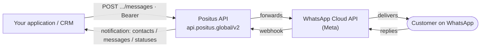

## Positus Architecture - WhatsApp Business API



<Info>
You can integrate directly with the Positus API (above) or use a customer service platform such as Robbu's Invenio, without building the integration yourself.
</Info>

| SDK                                                                                                    |                        |                                                        |
| ------------------------------------------------------------------------------------------------------ | ---------------------- | ------------------------------------------------------ |
| [https://github.com/positusapps/positus-api-laravel-client](https://github.com/positusapps/positus-api-laravel-client) | Laravel / PHP          | Youtube                                                |
| [https://github.com/positusapps/positus-api-php-client](https://github.com/positusapps/positus-api-php-client)         | PHP                    | [Youtube](https://www.youtube.com/watch?v=6hhHz73bsc4) |
| [https://www.nuget.org/packages/positus-api-csharp-client/](https://www.nuget.org/packages/positus-api-csharp-client/) | Nuget .NET / .NET Core | [YouTube](https://www.youtube.com/watch?v=E8MZWwfQSZY) |
| [https://github.com/positusapps/positus-api-csharp-client](https://github.com/positusapps/positus-api-csharp-client)   | Github for .NET        |                                                        |

<Info>
**Production Token:** Your token will be generated and provided by Positus; it grants access to all of your WhatsApp Business API numbers. The key will be provided after activation of each WhatsApp Business API number.

**Sandbox - Development Token**: You can generate your token directly through [http://studio.posit.us/](http://studio.posit.us/).
</Info>

## Postman file

*The **Postman** is a tool whose purpose is to test RESTful services (Web APIs) by sending HTTP requests and analyzing their responses.*
[Download Postman App](https://www.postman.com/downloads/)

<CardGroup cols={2}>
  <Card title="Production API" icon="file-arrow-down" href="/assets/Positus-API-2026.postman_collection.json">
    Positus API (2026).postman_collection.json
  </Card>
  <Card title="Development API (Sandbox)" icon="file-arrow-down" href="/assets/Positus-API-Sandbox-2026.postman_collection.json">
    Positus API Sandbox (2026).postman_collection.json
  </Card>
</CardGroup>

## messages

`POST` `https://api.positus.global/v2/whatsapp/numbers/{{chave}}/messages`

Use this route to send text messages via WhatsApp

#### Path Parameters

| Name  | Type   | Description                     |
| ----- | ------ | ------------------------------- |
| Chave | string | Unique code per WhatsApp number |

#### Headers

| Name           | Type   | Description                       |
| -------------- | ------ | --------------------------------- |
| Content-Type   | string | application/json                  |
| Authorization  | string | Authentication using Bearer Token |

#### Request Body

```json
{
  "to": "+5511999999999",
  "type": "text",
  "text": {
    "body": "your-message-content"
  }
}
```

#### Response

<Tabs>
  <Tab title="200">
    ```json
    {
        "messages": [
            {
                "id": "gBGHVRGZmZmZnwIJpWDiExk7olMZ"
            }
        ],
        "message": "The message was successfully sent"
    }
    ```
  </Tab>
  <Tab title="500">
    ```json
    {
        "errors": [
            {
                "code": ,
                "title": "",
                "details": ""
            }
        ],
        "message": ""
    }
    ```
  </Tab>
</Tabs>

## Typing indicator

`POST` `https://api.positus.global/v2/whatsapp/numbers/{{chave}}/messages/typing-indicator`

Displays the "typing…" indicator to the customer and marks the received message as read. Provide the `message_id` of the message sent by the customer. The indicator is automatically dismissed after about 25 seconds or as soon as you reply.

#### Path Parameters

| Name  | Type   | Description                     |
| ----- | ------ | ------------------------------- |
| Chave | string | Unique code per WhatsApp number |

#### Headers

| Name          | Type   | Description                       |
| ------------- | ------ | --------------------------------- |
| Authorization | string | Authentication using Bearer Token |
| Content-Type  | string | application/json                  |

#### Request Body

| Name       | Type   | Description                                       |
| ---------- | ------ | ------------------------------------------------- |
| message_id | string | **Required.** ID of the message received from the customer. |

```json
{
  "message_id": "wamid.HBgMNTUxMTk5OTk5OTk5FMA=="
}
```

#### Response

<Tabs>
  <Tab title="200">
    ```json
    {
        "success": true,
        "message": "The typing indicator was sent successfully"
    }
    ```
  </Tab>
  <Tab title="Error">
    ```json
    {
        "errors": [
            {
                "code": 0,
                "title": "",
                "details": ""
            }
        ],
        "message": "Unfortunately, we were unable to send the typing indicator"
    }
    ```
  </Tab>
</Tabs>

## HSM

`POST` `https://api.positus.global/v2/whatsapp/numbers/{{chave}}/messages`

Use this route to send notification messages via WhatsApp

HSM - These are message templates pre-approved by Facebook; they can be text, media, or file messages.

#### Path Parameters

| Name  | Type   | Description |
| ----- | ------ | ----------- |
| Chave | string |             |

#### Headers

| Name           | Type   | Description                       |
| -------------- | ------ | --------------------------------- |
| Authorization  | string | Authentication using Bearer Token |
| Content-Type   | string | application/json                  |

#### Request Body

<CodeGroup>

```json Completo
{
  "to": "+551199999999",
  "type": "template",
  "template": {
    "language": {
      "policy": "deterministic",
      "code": "pt_BR"
    },
    "name": "xxxxxx",
    "components": [
      {
        "type": "header",
        "parameters": [
          {
            "type": "image",
            "image": {
              "link": "https://dealers.rewebmkt.com/images/20190417084518-actros-3-1280.jpg"
            }
          }
        ]
      },
      {
        "type": "body",
        "parameters": [
          { "type": "text", "text": "Rafael" },
          { "type": "text", "text": "Mercedes-Benz" },
          { "type": "text", "text": "Actros" },
          { "type": "text", "text": "Cardiesel - Belo Horizonte" },
          { "type": "text", "text": "08/05/2020" }
        ]
      },
      {
        "type": "button",
        "sub_type": "url",
        "index": "0",
        "parameters": [
          { "type": "text", "text": "fMYMyV8x" }
        ]
      }
    ]
  }
}
```

```json Botões
{
  "to": "+5511999999999",
  "type": "template",
  "template": {
    "language": {
      "policy": "deterministic",
      "code": "pt_BR"
    },
    "name": "carteiro_botoes",
    "components": [
      {
        "type": "body",
        "parameters": [
          { "type": "text", "text": "Robbu" },
          { "type": "text", "text": "Thiago Thamiel" }
        ]
      },
      {
        "type": "button",
        "sub_type": "quick_reply",
        "index": "0"
      }
    ]
  }
}
```

</CodeGroup>

#### Response

<Tabs>
  <Tab title="200">
    ```json
    {
        "messages": [
            {
                "id": "gBGHVRGZmZmZnwIJpWDiExk7olMZ"
            }
        ],
        "message": "The message was successfully sent"
    }
    ```
  </Tab>
  <Tab title="500">
    ```json
    {
        "errors": [
            {
                "code": ,
                "title": "",
                "details": ""
            }
        ],
        "message": ""
    }
    ```
  </Tab>
</Tabs>

## Contact

`POST` `https://api.positus.global/v2/whatsapp/numbers/{{chave}}/messages`

Share contacts

#### Path Parameters

| Name  | Type   | Description                     |
| ----- | ------ | ------------------------------- |
| Chave | string | Unique code per WhatsApp number |

#### Headers

| Name           | Type   | Description                       |
| -------------- | ------ | --------------------------------- |
| Authorization  | string | Authentication using Bearer Token |
| Content-Type   | string | application/json                  |

#### Request Body

```json
{
  "to": "+5511999999999",
  "type": "contacts",
  "contacts": [
    {
      "addresses": [],
      "emails": [],
      "ims": [],
      "name": {
        "first_name": "Positus Provider",
        "formatted_name": "Positus Provider"
      },
      "org": [],
      "phones": [
        {
          "phone": "+55 11 2626-4234",
          "type": "CELL",
          "wa_id": "551126264234"
        }
      ],
      "urls": []
    }
  ]
}
```

#### Response

<Tabs>
  <Tab title="200">
    ```json
    {
        "messages": [
            {
                "id": "gBGHVRGZmZmZnwIJpWDiExk7olMZ"
            }
        ],
        "message": "The message was successfully sent"
    }
    ```
  </Tab>
  <Tab title="500">
    ```json
    {
        "errors": [
            {
                "code": ,
                "title": "",
                "details": ""
            }
        ],
        "message": ""
    }
    ```
  </Tab>
</Tabs>

## Location

`POST` `https://api.positus.global/v2/whatsapp/numbers/{{chave}}/messages`

Share locations

#### Path Parameters

| Name  | Type   | Description                     |
| ----- | ------ | ------------------------------- |
| Chave | string | Unique code per WhatsApp number |

#### Headers

| Name           | Type   | Description                       |
| -------------- | ------ | --------------------------------- |
| Authorization  | string | Authentication using Bearer Token |
| Content-Type   | string | application/json                  |

#### Request Body

```json
{
  "to": "+5511999999999",
  "type": "location",
  "location": {
    "longitude": -46.662787,
    "latitude": -23.553610,
    "name": "Robbu Brazil",
    "address": "Av. Angélica, 2530 - Bela Vista, São Paulo - SP, 01228-200"
  }
}
```

#### Response

<Tabs>
  <Tab title="200">
    ```json
    {
        "messages": [
            {
                "id": "gBGHVRGZmZmZnwIJpWDiExk7olMZ"
            }
        ],
        "message": "The message was successfully sent"
    }
    ```
  </Tab>
  <Tab title="500">
    ```json
    {
        "errors": [
            {
                "code": ,
                "title": "",
                "details": ""
            }
        ],
        "message": ""
    }
    ```
  </Tab>
</Tabs>

## Image

`POST` `https://api.positus.global/v2/whatsapp/numbers/{{chave}}/messages`

Share images

#### Path Parameters

| Name  | Type   | Description                     |
| ----- | ------ | ------------------------------- |
| Chave | string | Unique code per WhatsApp number |

#### Headers

| Name           | Type   | Description                       |
| -------------- | ------ | --------------------------------- |
| Authorization  | string | Authentication using Bearer Token |
| Content-Type   | string | application/json                  |

#### Request Body

```json
{
  "to": "+5511999999999",
  "type": "image",
  "image": {
    "link": "https://picsum.photos/200",
    "caption": "your-document-caption"
  }
}
```

#### Response

<Tabs>
  <Tab title="200">
    ```json
    {
        "messages": [
            {
                "id": "gBGHVRGZmZmZnwIJpWDiExk7olMZ"
            }
        ],
        "message": "The message was successfully sent"
    }
    ```
  </Tab>
  <Tab title="500">
    ```json
    {
        "errors": [
            {
                "code": ,
                "title": "",
                "details": ""
            }
        ],
        "message": ""
    }
    ```
  </Tab>
</Tabs>

## Document

`POST` `https://api.positus.global/v2/whatsapp/numbers/{{chave}}/messages`

Share documents

#### Path Parameters

| Name  | Type   | Description                     |
| ----- | ------ | ------------------------------- |
| Chave | string | Unique code per WhatsApp number |

#### Headers

| Name           | Type   | Description                       |
| -------------- | ------ | --------------------------------- |
| Authorization  | string | Authentication using Bearer Token |
| Content-Type   | string | application/json                  |

#### Request Body

```json
{
  "to": "+5511941489395",
  "type": "document",
  "document": {
    "link": "http://www.pdf995.com/samples/pdf.pdf",
    "caption": "your-document-caption"
  }
}
```

#### Response

<Tabs>
  <Tab title="200">
    ```json
    {
        "messages": [
            {
                "id": "gBGHVRGZmZmZnwIJpWDiExk7olMZ"
            }
        ],
        "message": "The message was successfully sent"
    }
    ```
  </Tab>
  <Tab title="500">
    ```json
    {
        "errors": [
            {
                "code": ,
                "title": "",
                "details": ""
            }
        ],
        "message": ""
    }
    ```
  </Tab>
</Tabs>

## Video

`POST` `https://api.positus.global/v2/whatsapp/numbers/{{chave}}/messages`

Share videos

#### Path Parameters

| Name  | Type   | Description                     |
| ----- | ------ | ------------------------------- |
| Chave | string | Unique code per WhatsApp number |

#### Headers

| Name           | Type   | Description                       |
| -------------- | ------ | --------------------------------- |
| Authorization  | string | Authentication using Bearer Token |
| Content-Type   | string | application/json                  |

#### Request Body

```json
{
  "to": "+5511999999999",
  "type": "video",
  "video": {
    "link": "https://sample-videos.com/video123/mp4/720/big_buck_bunny_720p_1mb.mp4",
    "caption": "your-document-caption"
  }
}
```

#### Response

<Tabs>
  <Tab title="200">
    ```json
    {
        "messages": [
            {
                "id": "gBGHVRGZmZmZnwIJpWDiExk7olMZ"
            }
        ],
        "message": "The message was successfully sent"
    }
    ```
  </Tab>
  <Tab title="500">
    ```json
    {
        "errors": [
            {
                "code": ,
                "title": "",
                "details": ""
            }
        ],
        "message": ""
    }
    ```
  </Tab>
</Tabs>

## Audio

`POST` `https://api.positus.global/v2/whatsapp/numbers/{{chave}}/messages`

Share audios

#### Path Parameters

| Name  | Type   | Description                     |
| ----- | ------ | ------------------------------- |
| Chave | string | Unique code per WhatsApp number |

#### Headers

| Name           | Type   | Description                       |
| -------------- | ------ | --------------------------------- |
| Authorization  | string | Authentication using Bearer Token |
| Content-Type   | string | application/json                  |

#### Request Body

```json
{
  "to": "+5511999999999",
  "type": "audio",
  "audio": {
    "link": "https://sample-videos.com/audio/mp3/crowd-cheering.mp3"
  }
}
```

#### Response

<Tabs>
  <Tab title="200">
    ```json
    {
        "messages": [
            {
                "id": "gBGHVRGZmZmZnwIJpWDiExk7olMZ"
            }
        ],
        "message": "The message was successfully sent"
    }
    ```
  </Tab>
  <Tab title="500">
    ```json
    {
        "errors": [
            {
                "code": ,
                "title": "",
                "details": ""
            }
        ],
        "message": ""
    }
    ```
  </Tab>
</Tabs>

## Sticker

`POST` `https://api.positus.global/v2/whatsapp/numbers/{{chave}}/messages`

Share stickers. The sticker format must be exactly 512x512

#### Path Parameters

| Name  | Type   | Description                     |
| ----- | ------ | ------------------------------- |
| Chave | string | Unique code per WhatsApp number |

#### Headers

| Name           | Type   | Description                       |
| -------------- | ------ | --------------------------------- |
| Authorization  | string | Authentication using Bearer Token |
| Content-Type   | string | application/json                  |

#### Request Body

```json
{
  "to": "+5511999999999",
  "type": "sticker",
  "sticker": {
    "link": "https://studio.posit.us/api/samples/sticker.webp"
  }
}
```

#### Response

<Tabs>
  <Tab title="200">
    ```json
    {
        "messages": [
            {
                "id": "gBGHVRGZmZmZnwIJpWDiExk7olMZ"
            }
        ],
        "message": "The message was successfully sent"
    }
    ```
  </Tab>
</Tabs>

## Download Media

`GET` `https://api.positus.global/v2/whatsapp/numbers/{{chave}}/media/{{messages.type.id}}`

Download the media files. Use the media `id` received in the webhook notification.

#### Path Parameters

| Name  | Type   | Description                       |
| ----- | ------ | --------------------------------- |
| Chave | string | Unique code per WhatsApp number   |
| id    | string | Media ID (received in the webhook) |

#### Headers

| Name          | Type   | Description                       |
| ------------- | ------ | --------------------------------- |
| Authorization | string | Authentication using Bearer Token |

#### Response

<Tabs>
  <Tab title="200">
    Returns the **binary content of the media**, with the `Content-Type` header matching the file type (e.g., `image/jpeg`, `audio/ogg`, `application/pdf`).
  </Tab>
  <Tab title="404">
    Media not found (returns the corresponding error from Meta).
  </Tab>
  <Tab title="429">
    Request limit reached at Meta. The response includes the `Retry-After` header (in seconds) indicating when to try again.

    ```json
    {
        "message": "..."
    }
    ```
  </Tab>
</Tabs>

## Interactive Messages - List

`POST` `https://api.positus.global/v2/whatsapp/numbers/{{chave}}/messages`

List Messages: Messages including a menu of up to 10 options. This type of message offers a simpler and more consistent way for users to make a selection when interacting with a business.

List or reply button messages cannot be used as notifications. Currently, they can only be sent within 24 hours of the last message sent by the user. If you try to send a message outside the 24-hour window, you will receive an error message.

#### Path Parameters

| Name  | Type   | Description                     |
| ----- | ------ | ------------------------------- |
| Chave | string | Unique code per WhatsApp number |

#### Headers

| Name           | Type   | Description                       |
| -------------- | ------ | --------------------------------- |
| Authorization  | string | Authentication using Bearer Token |
| Content-Type   | string | application/json                  |

#### Request Body

```json
{
  "to": "+5511999999999",
  "type": "interactive",
  "interactive": {
    "type": "list",
    "header": {
      "type": "text",
      "text": "CryptoBank"
    },
    "body": {
      "text": "Olá senhor Thiago Thamiel, me chamo Francisco Dabus estou falando referente ao Banco CryptoBank e você já pode regular sua pendência financeira por aqui. Veja as opções que preparamos para você!\n\n💼 Contrato: 82782361236213\n🗓️ Vencimento: 01/01/2021\n💰 Valor Atualizado: 232,83"
    },
    "footer": {
      "text": "Demonstração Robbu"
    },
    "action": {
      "button": "Opções de pagamento",
      "sections": [
        {
          "title": "Atualização",
          "rows": [
            {
              "id": "7",
              "title": "Vencimento Hoje",
              "description": "💰 R$ 201,23 - Parcelas 17 até 19 de 24"
            },
            {
              "id": "1",
              "title": "Vencimento Amanha",
              "description": "💰 R$ 219,32 - Parcelas 17 até 19 de 24"
            }
          ]
        },
        {
          "title": "Quitação",
          "rows": [
            {
              "id": "3",
              "title": "Vencimento Hoje",
              "description": "💰 R$ 1.323,21 - Todas as parcelas restantes"
            },
            {
              "id": "4",
              "title": "Vencimento Amanha",
              "description": "💰 R$ 1.382,34 - Todas as parcelas restantes"
            }
          ]
        }
      ]
    }
  }
}
```

#### Response

<Tabs>
  <Tab title="200">
    ```json
    {
        "messages": [
            {
                "id": "gBGHVRGZmZmZnwIJpWDiExk7olMZ"
            }
        ],
        "message": "The message was successfully sent"
    }
    ```
  </Tab>
</Tabs>

<Info>
Full documentation: [https://developers.facebook.com/docs/whatsapp/guides/interactive-messages](https://developers.facebook.com/docs/whatsapp/guides/interactive-messages)
</Info>

## Interactive Messages - Buttons

`POST` `https://api.positus.global/v2/whatsapp/numbers/{{chave}}/messages`

Reply buttons: Messages including up to 3 options — each option is a button. This type of message offers a faster way for users to make a selection from a menu when interacting with a business. Reply buttons provide the same user experience as interactive templates with buttons.

List or reply button messages cannot be used as notifications. Currently, they can only be sent within 24 hours of the last message sent by the user. If you try to send a message outside the 24-hour window, you will receive an error message.

#### Path Parameters

| Name  | Type   | Description                     |
| ----- | ------ | ------------------------------- |
| Chave | string | Unique code per WhatsApp number |

#### Headers

| Name           | Type   | Description                       |
| -------------- | ------ | --------------------------------- |
| Authorization  | string | Authentication using Bearer Token |
| Content-Type   | string | application/json                  |

#### Request Body

```json
{
  "to": "+5511999999999",
  "type": "interactive",
  "recipient_type": "individual",
  "interactive": {
    "type": "button",
    "header": {
      "type": "text",
      "text": "1 mês grátis"
    },
    "body": {
      "text": "Ótima escolha, agora você já pode ativar o seu número e realizar testes por 1 mês sem compromisso."
    },
    "footer": {
      "text": "https://posit.us"
    },
    "action": {
      "buttons": [
        {
          "type": "reply",
          "reply": {
            "id": "unique-postback-id-1",
            "title": "Criar conta grátis"
          }
        },
        {
          "type": "reply",
          "reply": {
            "id": "unique-postback-id-2",
            "title": "Falar com atendente"
          }
        }
      ]
    }
  }
}
```

#### Response

<Tabs>
  <Tab title="200">
    ```json
    {
        "messages": [
            {
                "id": "gBGHVRGZmZmZnwIJpWDiExk7olMZ"
            }
        ],
        "message": "The message was successfully sent"
    }
    ```
  </Tab>
</Tabs>

<Info>
Full documentation: [https://developers.facebook.com/docs/whatsapp/guides/interactive-messages](https://developers.facebook.com/docs/whatsapp/guides/interactive-messages)
</Info>
