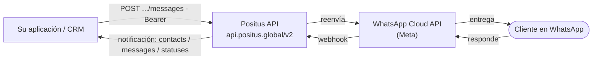

## Arquitectura Positus - WhatsApp Business API



<Info>
Puede integrarse directamente con la Positus API (arriba) o usar una plataforma de atención como Invenio de Robbu, sin desarrollar la integración.
</Info>

| SDK                                                                                                    |                        |                                                        |
| ------------------------------------------------------------------------------------------------------ | ---------------------- | ------------------------------------------------------ |
| [https://github.com/positusapps/positus-api-laravel-client](https://github.com/positusapps/positus-api-laravel-client) | Laravel / PHP          | Youtube                                                |
| [https://github.com/positusapps/positus-api-php-client](https://github.com/positusapps/positus-api-php-client)         | PHP                    | [Youtube](https://www.youtube.com/watch?v=6hhHz73bsc4) |
| [https://www.nuget.org/packages/positus-api-csharp-client/](https://www.nuget.org/packages/positus-api-csharp-client/) | Nuget .NET / .NET Core | [YouTube](https://www.youtube.com/watch?v=E8MZWwfQSZY) |
| [https://github.com/positusapps/positus-api-csharp-client](https://github.com/positusapps/positus-api-csharp-client)   | Github para .NET       |                                                        |

<Info>
**Token de Producción:** Tu token será generado y proporcionado por Positus, este dará acceso a todos tus números de WhatsApp Business API. La clave será proporcionada tras la activación de cada número de WhatsApp Business API.

**Sandbox - Token de desarrollo**: Podrás generar tu token directamente a través de [http://studio.posit.us/](http://studio.posit.us/).
</Info>

## Postman file

*El **Postman** es una herramienta que tiene como objetivo probar servicios RESTful (Web APIs) mediante el envío de solicitudes HTTP y el análisis de su respuesta.*
[Download Postman App](https://www.postman.com/downloads/)

<CardGroup cols={2}>
  <Card title="API de producción" icon="file-arrow-down" href="/assets/Positus-API-2026.postman_collection.json">
    Positus API (2026).postman_collection.json
  </Card>
  <Card title="API de desarrollo (Sandbox)" icon="file-arrow-down" href="/assets/Positus-API-Sandbox-2026.postman_collection.json">
    Positus API Sandbox (2026).postman_collection.json
  </Card>
</CardGroup>

## messages

`POST` `https://api.positus.global/v2/whatsapp/numbers/{{chave}}/messages`

Utiliza esta ruta para enviar mensajes de texto vía WhatsApp

#### Path Parameters

| Name  | Type   | Description                         |
| ----- | ------ | ----------------------------------- |
| Chave | string | Código único por número de WhatsApp |

#### Headers

| Name           | Type   | Description                      |
| -------------- | ------ | -------------------------------- |
| Content-Type   | string | application/json                 |
| Authorization  | string | Autenticación usando Bearer Token |

#### Request Body

```json
{
  "to": "+5511999999999",
  "type": "text",
  "text": {
    "body": "your-message-content"
  }
}
```

#### Response

<Tabs>
  <Tab title="200">
    ```json
    {
        "messages": [
            {
                "id": "gBGHVRGZmZmZnwIJpWDiExk7olMZ"
            }
        ],
        "message": "The message was successfully sent"
    }
    ```
  </Tab>
  <Tab title="500">
    ```json
    {
        "errors": [
            {
                "code": ,
                "title": "",
                "details": ""
            }
        ],
        "message": ""
    }
    ```
  </Tab>
</Tabs>

### Destinatario: teléfono (`to`) o BSUID (`recipient`) <a href="#recipient" id="recipient"></a>

Todas las rutas de envío de mensajes aceptan **dos formas** de identificar al destinatario. Usa **una U otra**:

| Campo       | Tipo   | Obligatoriedad                           | Descripción                                                                                                                                                     |
| ----------- | ------ | ---------------------------------------- | ------------------------------------------------------------------------------------------------------------------------------------------------------------- |
| `to`        | string | Obligatorio si se omite `recipient`      | Teléfono del destinatario en formato internacional (ej.: `+5511999999999`).                                                                                    |
| `recipient` | string | Opcional — envíe en lugar de `to`             | **BSUID** (*Business-Scoped User ID*) o **parent BSUID** del destinatario (ej.: `BR.1234567890`). Consulta [BSUID e identificadores de usuario](/es/positus/integracion/bsuid). |

<Info>
El **BSUID** es un identificador de usuario acotado al portafolio de negocios, entregado en el campo `user_id` de los webhooks. Es útil cuando el usuario adoptó un **username** y el teléfono (`wa_id`) puede no venir en el payload. Entiende el concepto en [BSUID e identificadores de usuario](/es/positus/integracion/bsuid).
</Info>

<Warning>
**Precedencia cuando `to` y `recipient` coexisten:** si envías ambos campos en la misma solicitud, el **teléfono (`to`) prevalece** — el mensaje se entrega al teléfono. Por eso, envía **solo uno de los dos**: solo `to` (teléfono) o solo `recipient` (BSUID/parent BSUID).
</Warning>

<Note>
Los números **on-premises** aceptan solo `to` (teléfono). El envío por `recipient` (BSUID) está disponible únicamente para números en la **Cloud API** (Meta).
</Note>

#### Request Body (envío a un BSUID)

```json
{
  "recipient": "BR.1234567890",
  "type": "text",
  "text": {
    "body": "your-message-content"
  }
}
```

#### Response (envío a un BSUID)

La respuesta es la misma que en los demás envíos, pero el bloque `contacts` — reenviado de Meta — trae el identificador que usaste en `input`, además del teléfono (`wa_id`, cuando esté disponible) y del BSUID (`user_id`).

<Tabs>
  <Tab title="200">
    ```json
    {
        "contacts": [
            {
                "input": "BR.1234567890",
                "wa_id": "5511999999999",
                "user_id": "BR.1234567890"
            }
        ],
        "messages": [
            {
                "id": "gBGHVRGZmZmZnwIJpWDiExk7olMZ"
            }
        ],
        "message": "The message was successfully sent"
    }
    ```
  </Tab>
  <Tab title="500">
    ```json
    {
        "errors": [
            {
                "code": 131062,
                "title": "Business-scoped User ID (BSUID) recipients are not supported for this message.",
                "details": "Business-scoped User ID (BSUID) recipients are not supported for this message."
            }
        ]
    }
    ```
  </Tab>
</Tabs>

<Note>
**Casos especiales que exigen teléfono (no aceptan BSUID):** plantillas de **autenticación** de los tipos **one-tap**, **zero-tap** y **copy-code**. En esos casos, informa siempre `to` (teléfono). Si envías un BSUID donde no es compatible, Meta responde con el error `131062`.
</Note>

## Indicador de escritura

`POST` `https://api.positus.global/v2/whatsapp/numbers/{{chave}}/messages/typing-indicator`

Muestra el indicador "escribiendo…" para el cliente y marca como leído el mensaje recibido. Informa el `message_id` del mensaje enviado por el cliente. El indicador se descarta automáticamente después de aproximadamente 25 segundos o en cuanto respondes.

#### Path Parameters

| Name  | Type   | Description                         |
| ----- | ------ | ----------------------------------- |
| Chave | string | Código único por número de WhatsApp |

#### Headers

| Name          | Type   | Description                      |
| ------------- | ------ | -------------------------------- |
| Authorization | string | Autenticación usando Bearer Token |
| Content-Type  | string | application/json                 |

#### Request Body

| Name       | Type   | Description                                          |
| ---------- | ------ | ---------------------------------------------------- |
| message_id | string | **Obligatorio.** ID del mensaje recibido del cliente. |

```json
{
  "message_id": "wamid.HBgMNTUxMTk5OTk5OTk5FMA=="
}
```

#### Response

<Tabs>
  <Tab title="200">
    ```json
    {
        "success": true,
        "message": "The typing indicator was sent successfully"
    }
    ```
  </Tab>
  <Tab title="Error">
    ```json
    {
        "errors": [
            {
                "code": 0,
                "title": "",
                "details": ""
            }
        ],
        "message": "Unfortunately, we were unable to send the typing indicator"
    }
    ```
  </Tab>
</Tabs>

## HSM

`POST` `https://api.positus.global/v2/whatsapp/numbers/{{chave}}/messages`

Utiliza esta ruta para enviar mensajes de notificación vía WhatsApp

HSM - Son plantillas de mensajes preaprobadas por Facebook, pueden ser mensajes de texto, medios o archivos.

<Info>
El destinatario puede informarse por teléfono (`to`) **o** por BSUID (`recipient`), como se describe en [Destinatario: teléfono (`to`) o BSUID (`recipient`)](#recipient). **Excepción:** las plantillas de **autenticación** one-tap, zero-tap y copy-code exigen el **teléfono** (`to`) y no aceptan BSUID.
</Info>

#### Path Parameters

| Name  | Type   | Description |
| ----- | ------ | ----------- |
| Chave | string |             |

#### Headers

| Name           | Type   | Description                      |
| -------------- | ------ | -------------------------------- |
| Authorization  | string | Autenticación usando Bearer Token |
| Content-Type   | string | application/json                 |

#### Request Body

<CodeGroup>

```json Completo
{
  "to": "+551199999999",
  "type": "template",
  "template": {
    "language": {
      "policy": "deterministic",
      "code": "pt_BR"
    },
    "name": "xxxxxx",
    "components": [
      {
        "type": "header",
        "parameters": [
          {
            "type": "image",
            "image": {
              "link": "https://dealers.rewebmkt.com/images/20190417084518-actros-3-1280.jpg"
            }
          }
        ]
      },
      {
        "type": "body",
        "parameters": [
          { "type": "text", "text": "Rafael" },
          { "type": "text", "text": "Mercedes-Benz" },
          { "type": "text", "text": "Actros" },
          { "type": "text", "text": "Cardiesel - Belo Horizonte" },
          { "type": "text", "text": "08/05/2020" }
        ]
      },
      {
        "type": "button",
        "sub_type": "url",
        "index": "0",
        "parameters": [
          { "type": "text", "text": "fMYMyV8x" }
        ]
      }
    ]
  }
}
```

```json Botones
{
  "to": "+5511999999999",
  "type": "template",
  "template": {
    "language": {
      "policy": "deterministic",
      "code": "pt_BR"
    },
    "name": "carteiro_botoes",
    "components": [
      {
        "type": "body",
        "parameters": [
          { "type": "text", "text": "Robbu" },
          { "type": "text", "text": "Thiago Thamiel" }
        ]
      },
      {
        "type": "button",
        "sub_type": "quick_reply",
        "index": "0"
      }
    ]
  }
}
```

</CodeGroup>

#### Response

<Tabs>
  <Tab title="200">
    ```json
    {
        "messages": [
            {
                "id": "gBGHVRGZmZmZnwIJpWDiExk7olMZ"
            }
        ],
        "message": "The message was successfully sent"
    }
    ```
  </Tab>
  <Tab title="500">
    ```json
    {
        "errors": [
            {
                "code": ,
                "title": "",
                "details": ""
            }
        ],
        "message": ""
    }
    ```
  </Tab>
</Tabs>

## Contact

`POST` `https://api.positus.global/v2/whatsapp/numbers/{{chave}}/messages`

Comparte contactos

#### Path Parameters

| Name  | Type   | Description                         |
| ----- | ------ | ----------------------------------- |
| Chave | string | Código único por número de WhatsApp |

#### Headers

| Name           | Type   | Description                      |
| -------------- | ------ | -------------------------------- |
| Authorization  | string | Autenticación usando Bearer Token |
| Content-Type   | string | application/json                 |

#### Request Body

```json
{
  "to": "+5511999999999",
  "type": "contacts",
  "contacts": [
    {
      "addresses": [],
      "emails": [],
      "ims": [],
      "name": {
        "first_name": "Positus Provider",
        "formatted_name": "Positus Provider"
      },
      "org": [],
      "phones": [
        {
          "phone": "+55 11 2626-4234",
          "type": "CELL",
          "wa_id": "551126264234"
        }
      ],
      "urls": []
    }
  ]
}
```

#### Response

<Tabs>
  <Tab title="200">
    ```json
    {
        "messages": [
            {
                "id": "gBGHVRGZmZmZnwIJpWDiExk7olMZ"
            }
        ],
        "message": "The message was successfully sent"
    }
    ```
  </Tab>
  <Tab title="500">
    ```json
    {
        "errors": [
            {
                "code": ,
                "title": "",
                "details": ""
            }
        ],
        "message": ""
    }
    ```
  </Tab>
</Tabs>

## Location

`POST` `https://api.positus.global/v2/whatsapp/numbers/{{chave}}/messages`

Comparte ubicaciones

#### Path Parameters

| Name  | Type   | Description                         |
| ----- | ------ | ----------------------------------- |
| Chave | string | Código único por número de WhatsApp |

#### Headers

| Name           | Type   | Description                      |
| -------------- | ------ | -------------------------------- |
| Authorization  | string | Autenticación usando Bearer Token |
| Content-Type   | string | application/json                 |

#### Request Body

```json
{
  "to": "+5511999999999",
  "type": "location",
  "location": {
    "longitude": -46.662787,
    "latitude": -23.553610,
    "name": "Robbu Brazil",
    "address": "Av. Angélica, 2530 - Bela Vista, São Paulo - SP, 01228-200"
  }
}
```

#### Response

<Tabs>
  <Tab title="200">
    ```json
    {
        "messages": [
            {
                "id": "gBGHVRGZmZmZnwIJpWDiExk7olMZ"
            }
        ],
        "message": "The message was successfully sent"
    }
    ```
  </Tab>
  <Tab title="500">
    ```json
    {
        "errors": [
            {
                "code": ,
                "title": "",
                "details": ""
            }
        ],
        "message": ""
    }
    ```
  </Tab>
</Tabs>

## Image

`POST` `https://api.positus.global/v2/whatsapp/numbers/{{chave}}/messages`

Comparte imágenes

#### Path Parameters

| Name  | Type   | Description                         |
| ----- | ------ | ----------------------------------- |
| Chave | string | Código único por número de WhatsApp |

#### Headers

| Name           | Type   | Description                      |
| -------------- | ------ | -------------------------------- |
| Authorization  | string | Autenticación usando Bearer Token |
| Content-Type   | string | application/json                 |

#### Request Body

```json
{
  "to": "+5511999999999",
  "type": "image",
  "image": {
    "link": "https://picsum.photos/200",
    "caption": "your-document-caption"
  }
}
```

#### Response

<Tabs>
  <Tab title="200">
    ```json
    {
        "messages": [
            {
                "id": "gBGHVRGZmZmZnwIJpWDiExk7olMZ"
            }
        ],
        "message": "The message was successfully sent"
    }
    ```
  </Tab>
  <Tab title="500">
    ```json
    {
        "errors": [
            {
                "code": ,
                "title": "",
                "details": ""
            }
        ],
        "message": ""
    }
    ```
  </Tab>
</Tabs>

## Document

`POST` `https://api.positus.global/v2/whatsapp/numbers/{{chave}}/messages`

Comparte documentos

#### Path Parameters

| Name  | Type   | Description                         |
| ----- | ------ | ----------------------------------- |
| Chave | string | Código único por número de WhatsApp |

#### Headers

| Name           | Type   | Description                      |
| -------------- | ------ | -------------------------------- |
| Authorization  | string | Autenticación usando Bearer Token |
| Content-Type   | string | application/json                 |

#### Request Body

```json
{
  "to": "+5511941489395",
  "type": "document",
  "document": {
    "link": "http://www.pdf995.com/samples/pdf.pdf",
    "caption": "your-document-caption"
  }
}
```

#### Response

<Tabs>
  <Tab title="200">
    ```json
    {
        "messages": [
            {
                "id": "gBGHVRGZmZmZnwIJpWDiExk7olMZ"
            }
        ],
        "message": "The message was successfully sent"
    }
    ```
  </Tab>
  <Tab title="500">
    ```json
    {
        "errors": [
            {
                "code": ,
                "title": "",
                "details": ""
            }
        ],
        "message": ""
    }
    ```
  </Tab>
</Tabs>

## Video

`POST` `https://api.positus.global/v2/whatsapp/numbers/{{chave}}/messages`

Comparte videos

#### Path Parameters

| Name  | Type   | Description                         |
| ----- | ------ | ----------------------------------- |
| Chave | string | Código único por número de WhatsApp |

#### Headers

| Name           | Type   | Description                      |
| -------------- | ------ | -------------------------------- |
| Authorization  | string | Autenticación usando Bearer Token |
| Content-Type   | string | application/json                 |

#### Request Body

```json
{
  "to": "+5511999999999",
  "type": "video",
  "video": {
    "link": "https://sample-videos.com/video123/mp4/720/big_buck_bunny_720p_1mb.mp4",
    "caption": "your-document-caption"
  }
}
```

#### Response

<Tabs>
  <Tab title="200">
    ```json
    {
        "messages": [
            {
                "id": "gBGHVRGZmZmZnwIJpWDiExk7olMZ"
            }
        ],
        "message": "The message was successfully sent"
    }
    ```
  </Tab>
  <Tab title="500">
    ```json
    {
        "errors": [
            {
                "code": ,
                "title": "",
                "details": ""
            }
        ],
        "message": ""
    }
    ```
  </Tab>
</Tabs>

## Audio

`POST` `https://api.positus.global/v2/whatsapp/numbers/{{chave}}/messages`

Comparte audios

#### Path Parameters

| Name  | Type   | Description                         |
| ----- | ------ | ----------------------------------- |
| Chave | string | Código único por número de WhatsApp |

#### Headers

| Name           | Type   | Description                      |
| -------------- | ------ | -------------------------------- |
| Authorization  | string | Autenticación usando Bearer Token |
| Content-Type   | string | application/json                 |

#### Request Body

```json
{
  "to": "+5511999999999",
  "type": "audio",
  "audio": {
    "link": "https://sample-videos.com/audio/mp3/crowd-cheering.mp3"
  }
}
```

#### Response

<Tabs>
  <Tab title="200">
    ```json
    {
        "messages": [
            {
                "id": "gBGHVRGZmZmZnwIJpWDiExk7olMZ"
            }
        ],
        "message": "The message was successfully sent"
    }
    ```
  </Tab>
  <Tab title="500">
    ```json
    {
        "errors": [
            {
                "code": ,
                "title": "",
                "details": ""
            }
        ],
        "message": ""
    }
    ```
  </Tab>
</Tabs>

## Sticker

`POST` `https://api.positus.global/v2/whatsapp/numbers/{{chave}}/messages`

Comparte stickers. El formato del sticker tiene que ser exactamente 512x512

#### Path Parameters

| Name  | Type   | Description                         |
| ----- | ------ | ----------------------------------- |
| Chave | string | Código único por número de WhatsApp |

#### Headers

| Name           | Type   | Description                      |
| -------------- | ------ | -------------------------------- |
| Authorization  | string | Autenticación usando Bearer Token |
| Content-Type   | string | application/json                 |

#### Request Body

```json
{
  "to": "+5511999999999",
  "type": "sticker",
  "sticker": {
    "link": "https://studio.posit.us/api/samples/sticker.webp"
  }
}
```

#### Response

<Tabs>
  <Tab title="200">
    ```json
    {
        "messages": [
            {
                "id": "gBGHVRGZmZmZnwIJpWDiExk7olMZ"
            }
        ],
        "message": "The message was successfully sent"
    }
    ```
  </Tab>
</Tabs>

## Download Medios

`GET` `https://api.positus.global/v2/whatsapp/numbers/{{chave}}/media/{{messages.type.id}}`

Descarga los medios. Usa el `id` del medio recibido en la notificación de webhook.

#### Path Parameters

| Name  | Type   | Description                         |
| ----- | ------ | ----------------------------------- |
| Chave | string | Código único por número de WhatsApp |
| id    | string | ID del medio (recibido en el webhook) |

#### Headers

| Name          | Type   | Description                      |
| ------------- | ------ | -------------------------------- |
| Authorization | string | Autenticación usando Bearer Token |

#### Response

<Tabs>
  <Tab title="200">
    Devuelve el **contenido binario del medio**, con el encabezado `Content-Type` correspondiente al tipo del archivo (ej.: `image/jpeg`, `audio/ogg`, `application/pdf`).
  </Tab>
  <Tab title="404">
    Medio no encontrado (devuelve el error correspondiente de Meta).
  </Tab>
  <Tab title="429">
    Límite de solicitudes alcanzado en Meta. La respuesta incluye el encabezado `Retry-After` (en segundos) que indica cuándo volver a intentarlo.

    ```json
    {
        "message": "..."
    }
    ```
  </Tab>
</Tabs>

## Mensajes Interactivos - Lista

`POST` `https://api.positus.global/v2/whatsapp/numbers/{{chave}}/messages`

Listar Mensajes: Mensajes que incluyen un menú de hasta 10 opciones. Este tipo de mensaje ofrece una manera más simple y consistente para que los usuarios hagan una selección al interactuar con una empresa.

Los mensajes de botón de lista o de respuesta no pueden usarse como notificaciones. Actualmente, solo pueden enviarse dentro de las 24 horas del último mensaje enviado por el usuario. Si intentas enviar un mensaje fuera de la ventana de 24 horas, recibirás un mensaje de error.

#### Path Parameters

| Name  | Type   | Description                         |
| ----- | ------ | ----------------------------------- |
| Chave | string | Código único por número de WhatsApp |

#### Headers

| Name           | Type   | Description                      |
| -------------- | ------ | -------------------------------- |
| Authorization  | string | Autenticación usando Bearer Token |
| Content-Type   | string | application/json                 |

#### Request Body

```json
{
  "to": "+5511999999999",
  "type": "interactive",
  "interactive": {
    "type": "list",
    "header": {
      "type": "text",
      "text": "CryptoBank"
    },
    "body": {
      "text": "Olá senhor Thiago Thamiel, me chamo Francisco Dabus estou falando referente ao Banco CryptoBank e você já pode regular sua pendência financeira por aqui. Veja as opções que preparamos para você!\n\n💼 Contrato: 82782361236213\n🗓️ Vencimento: 01/01/2021\n💰 Valor Atualizado: 232,83"
    },
    "footer": {
      "text": "Demonstração Robbu"
    },
    "action": {
      "button": "Opções de pagamento",
      "sections": [
        {
          "title": "Atualização",
          "rows": [
            {
              "id": "7",
              "title": "Vencimento Hoje",
              "description": "💰 R$ 201,23 - Parcelas 17 até 19 de 24"
            },
            {
              "id": "1",
              "title": "Vencimento Amanha",
              "description": "💰 R$ 219,32 - Parcelas 17 até 19 de 24"
            }
          ]
        },
        {
          "title": "Quitação",
          "rows": [
            {
              "id": "3",
              "title": "Vencimento Hoje",
              "description": "💰 R$ 1.323,21 - Todas as parcelas restantes"
            },
            {
              "id": "4",
              "title": "Vencimento Amanha",
              "description": "💰 R$ 1.382,34 - Todas as parcelas restantes"
            }
          ]
        }
      ]
    }
  }
}
```

#### Response

<Tabs>
  <Tab title="200">
    ```json
    {
        "messages": [
            {
                "id": "gBGHVRGZmZmZnwIJpWDiExk7olMZ"
            }
        ],
        "message": "The message was successfully sent"
    }
    ```
  </Tab>
</Tabs>

<Info>
Documentación completa: [https://developers.facebook.com/docs/whatsapp/guides/interactive-messages](https://developers.facebook.com/docs/whatsapp/guides/interactive-messages)
</Info>

## Mensajes Interactivos - Botones

`POST` `https://api.positus.global/v2/whatsapp/numbers/{{chave}}/messages`

Botones de respuesta: Mensajes que incluyen hasta 3 opciones — cada opción es un botón. Este tipo de mensaje ofrece una manera más rápida para que los usuarios hagan una selección a partir de un menú al interactuar con una empresa. Los botones de respuesta tienen la misma experiencia de usuario que las plantillas interactivas con botones.

Los mensajes de botón de lista o de respuesta no pueden usarse como notificaciones. Actualmente, solo pueden enviarse dentro de las 24 horas del último mensaje enviado por el usuario. Si intentas enviar un mensaje fuera de la ventana de 24 horas, recibirás un mensaje de error.

#### Path Parameters

| Name  | Type   | Description                         |
| ----- | ------ | ----------------------------------- |
| Chave | string | Código único por número de WhatsApp |

#### Headers

| Name           | Type   | Description                      |
| -------------- | ------ | -------------------------------- |
| Authorization  | string | Autenticación usando Bearer Token |
| Content-Type   | string | application/json                 |

#### Request Body

```json
{
  "to": "+5511999999999",
  "type": "interactive",
  "recipient_type": "individual",
  "interactive": {
    "type": "button",
    "header": {
      "type": "text",
      "text": "1 mês grátis"
    },
    "body": {
      "text": "Ótima escolha, agora você já pode ativar o seu número e realizar testes por 1 mês sem compromisso."
    },
    "footer": {
      "text": "https://posit.us"
    },
    "action": {
      "buttons": [
        {
          "type": "reply",
          "reply": {
            "id": "unique-postback-id-1",
            "title": "Criar conta grátis"
          }
        },
        {
          "type": "reply",
          "reply": {
            "id": "unique-postback-id-2",
            "title": "Falar com atendente"
          }
        }
      ]
    }
  }
}
```

#### Response

<Tabs>
  <Tab title="200">
    ```json
    {
        "messages": [
            {
                "id": "gBGHVRGZmZmZnwIJpWDiExk7olMZ"
            }
        ],
        "message": "The message was successfully sent"
    }
    ```
  </Tab>
</Tabs>

<Info>
Documentación completa: [https://developers.facebook.com/docs/whatsapp/guides/interactive-messages](https://developers.facebook.com/docs/whatsapp/guides/interactive-messages)
</Info>
